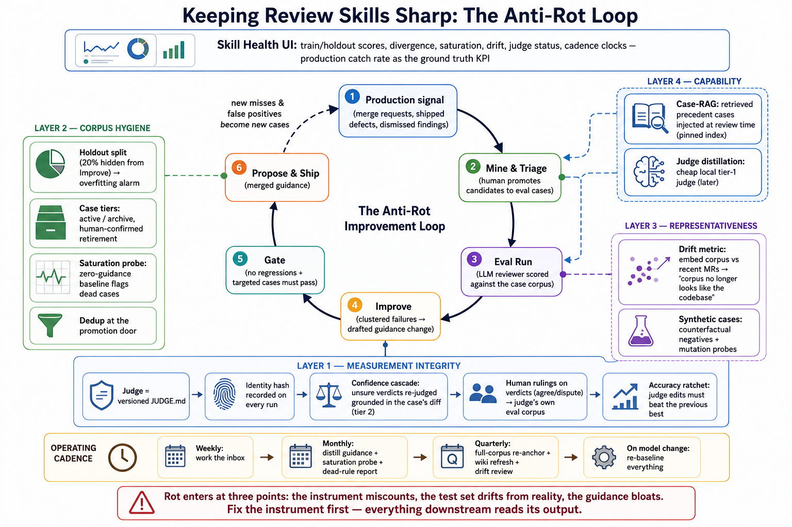
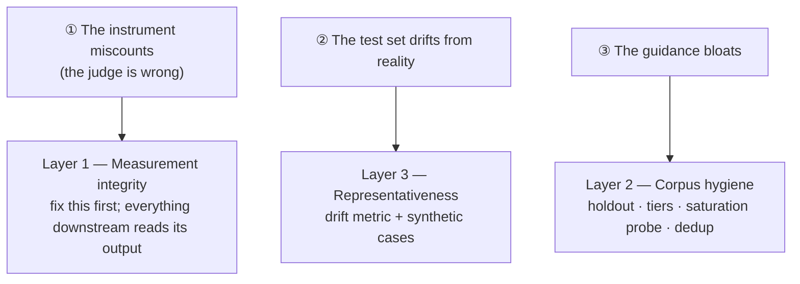
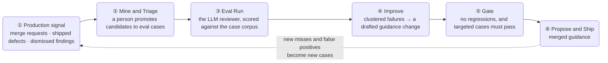
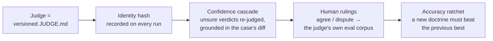
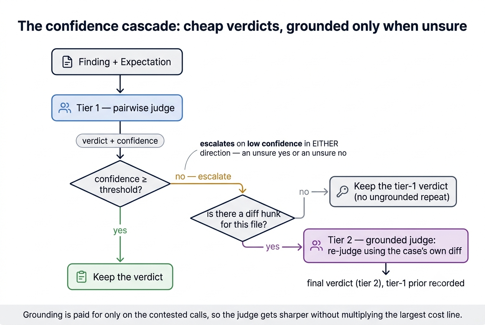
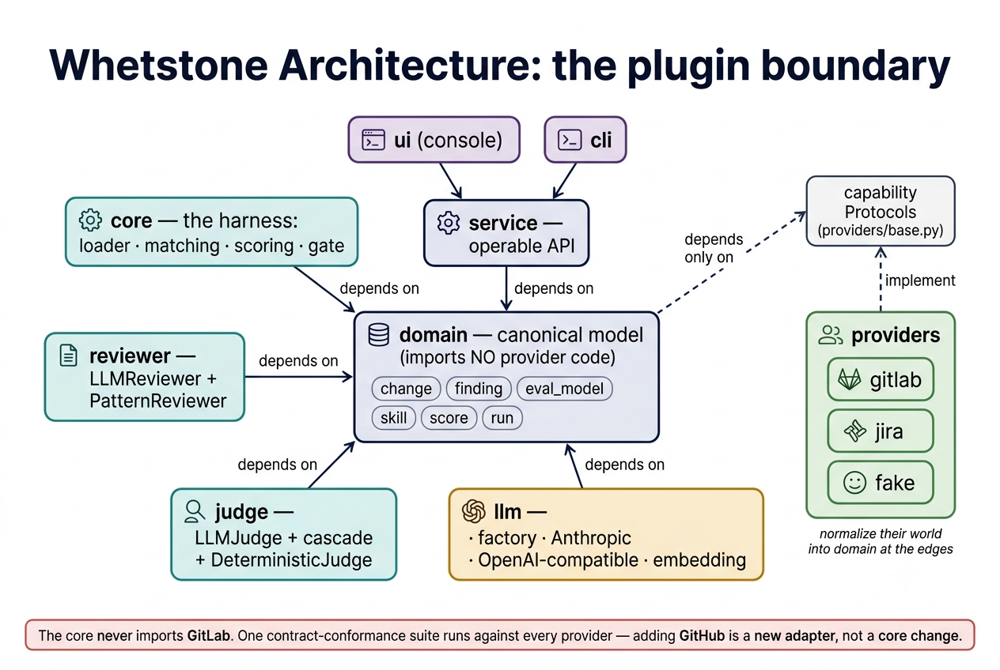
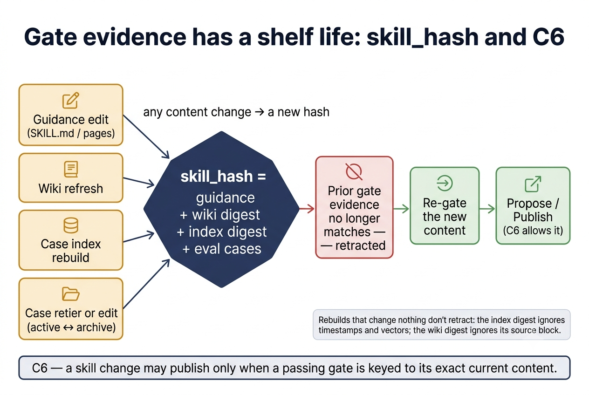
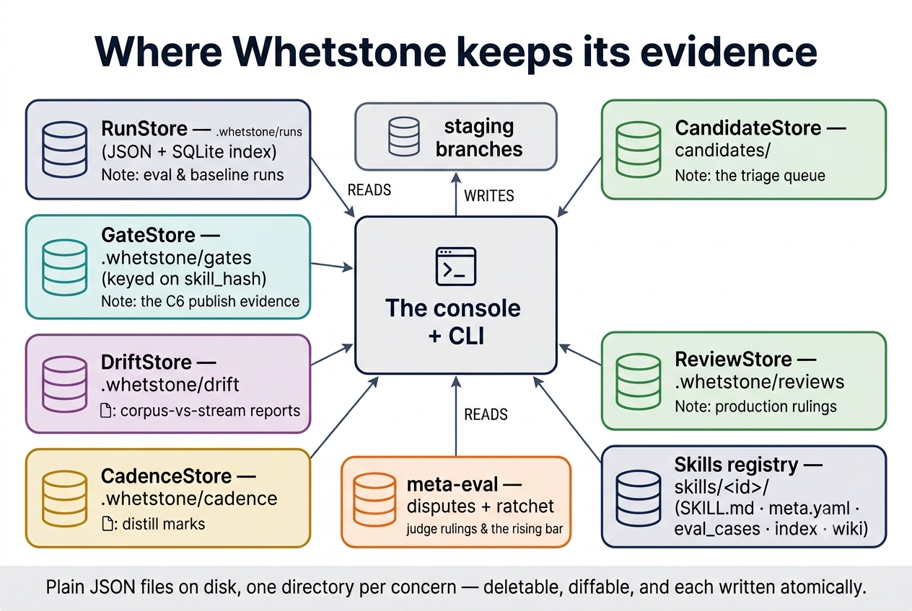

# Whetstone

A system for keeping a company's agent **skills** (code review, arch review, secret-scanning, …)
continuously sharp. It learns from GitLab merge-request reviews, from the defects your tracker says
shipped anyway, and from the codebase — and, critically, **never ships a skill change it can't prove
is a net improvement**, because every change passes an evaluated regression gate first.

> **The thesis:** most AI review tools are stateless — they review each PR fresh. Whetstone treats
> the *skill* as the durable, versioned knowledge artifact and turns human review signals into
> measurable improvements to it. The output isn't a review; it's a *better reviewer for next time*,
> tool-agnostic and governed.

At its core is **the eval / backtest harness and regression gate** — the measurement substrate
everything else stands on. Built on top of it is the **anti-rot loop** (see
[below](#keeping-skills-sharp-the-anti-rot-loop) and [`ANTI_ROT_PLAN.md`](ANTI_ROT_PLAN.md)): corpus
mining and triage, a guidance drafter, the holdout/tier/saturation/drift machinery, a versioned and
self-measuring judge, and a console that puts every skill's state of affairs on one surface. See
[`docs/milestone-1-eval-harness.md`](docs/milestone-1-eval-harness.md) for the harness design and
[`docs/decisions.md`](docs/decisions.md) for the architecture decisions.

---

## Table of contents

1. [How it works](#how-it-works)
2. [Keeping skills sharp: the anti-rot loop](#keeping-skills-sharp-the-anti-rot-loop)
3. [Architecture](#architecture)
4. [Install & setup](#install--setup)
5. [The skill format](#the-skill-format)
6. [Eval cases](#eval-cases)
7. [Scoring model](#scoring-model)
8. [The regression gate](#the-regression-gate)
9. [The skill pipeline](docs/skill-pipeline.md) — `evaluate/`, `improve/`, `update/`, and the wiki
10. [CLI reference](#cli-reference)
11. [Run records & reports](#run-records--reports)
12. [The console (`whetstone ui`)](#the-console-whetstone-ui)
13. [Configuration (`whetstone.toml`)](#configuration-whetstonetoml)
14. [Programmatic API (`whetstone.service`)](#programmatic-api-whetstoneservice)
15. [Providers & the plugin architecture](#providers--the-plugin-architecture)
16. [The corpus builder](#the-corpus-builder)
17. [The LLM layer](#the-llm-layer)
18. [Reviewers & judges](#reviewers--judges)
19. [Meta-evaluation (validating the judge and the drafter)](#meta-evaluation-validating-the-judge-and-the-drafter)
20. [Testing](#testing)
21. [Extending Whetstone](#extending-whetstone)
22. [Environment variables](#environment-variables)
23. [Repository layout](#repository-layout)

---

## How it works

A skill is scored by **replaying eval cases** through an LLM reviewer running that skill's guidance,
then checking the reviewer's findings against what each case expects:

```
  skill (SKILL.md guidance + eval_cases/)
        │
        ▼
  LLMReviewer(skill, change) ─────────▶ findings
        │                                  │
        │        LLMJudge(finding, expectation) ── semantic match?
        ▼                                  ▼
  per-case Confusion (TP/FN/FP/TN) ──▶ SkillScore (recall, fp_rate, precision, F2)
        │
        ▼
  gate(old_score, new_score) ──▶ PASS / FAIL   ← the CI seam
```

- **`should_catch` cases** measure **recall**: given a change with a known issue, does the reviewer
  surface it?
- **`should_not_flag` cases** measure **precision**: given a change humans approved, does the
  reviewer stay quiet?
- The **gate** compares a baseline skill version against a candidate and fails if recall drops or
  false positives rise.

Everything is deterministically testable: the two nondeterministic edges (the reviewer and the
judge) both have `Fake` implementations, so the entire harness runs with **no model and no network**.

### The sharpening loop

Scoring is half of it. The other half is the loop that produces something to score — and it is worth
being precise about which parts are automatic and which are a person's judgement:

```
  GitLab MRs + Jira defects            ← real review history and shipped bugs
        │  corpus pull                    (automatic)
        ▼
  candidate eval cases                 ← proposed, never merged blind
        │  triage: rewrite, route, accept / reject   (a person, in the console)
        ▼
  skills/<id>/eval_cases/              ← the skill's test suite grows
        │
        │  ── a person edits the rules, in the console's guidance editor ──
        ▼
  skills/<id>/SKILL.md on whetstone/skill/<id>
        │  eval gate --targeted <case>    (measures whether the edit is an improvement)
        ▼
  a stored gate record, keyed to that exact content
        │  Propose MR                     (refused unless a passing gate covers it)
        ▼
  merge request
```

**Nothing here writes guidance blind.** The corpus builder proposes test data, the *improve* step
drafts a guidance change from a run's clustered failures, and the gate rules on whether that rewrite
was an improvement — but a human reads every draft before it is staged, and the console refuses to
publish one no passing gate covers. The drafter is an assistant inside the loop, not an autopilot
around it: its output enters at the same place a person's edit does and faces the same gate.

---

## Keeping skills sharp: the anti-rot loop

A test suite that never changes rots: the reviewer keeps passing an exam that stopped resembling the
job. Whetstone's answer is a loop that continuously *replaces its own exam* from live signal, plus
four layers of machinery that keep the loop honest. The whole system is below; the rest of this
section is a guided tour of it.



> **Rot enters at three points — and they are not equal.** The instrument miscounts, the test set
> drifts from reality, or the guidance bloats. **Fix the instrument first:** every score, gate, and
> alarm downstream reads the judge's output, so a judge that is wrong makes every other number a
> confident lie. The layers below are ordered by that priority.



### The improvement loop

Live review signal becomes eval cases; eval cases score the reviewer; failures draft a change; a
gate proves the change is a net improvement before it ships — and the misses and false positives the
shipped skill produces become the next round's cases. It closes on itself.



| Stage | What runs | In the code / console |
|---|---|---|
| ① Production signal | GitLab MRs, shipped defects, dismissed findings | `corpus pull`, the `[watch]` connector |
| ② Mine and Triage | a person promotes candidates to eval cases | `corpus/builder.py`, **Triage** screen |
| ③ Eval Run | the reviewer scored against the corpus | `service.record_eval`, **Skill → header → Run evals** |
| ④ Improve | clustered failures → a drafted guidance change | `improve/` step, **Skill → Improve** (or Edit → Draft a change) |
| ⑤ Gate | no regressions; targeted cases must pass | `service.record_gate`, **Skill → Improve / Edit → Run the gate** |
| ⑥ Propose and Ship | the merged guidance | *Propose MR*, refused without a passing gate (C6) |

### Layer 1 — Measurement integrity (fix the instrument first)

The judge decides whether a finding *means* what an expectation describes; every score is built on
its verdicts. So the judge is versioned, identified, cross-examined on the hard calls, ruled on by
people, and held to a bar that only rises.



- **Versioned doctrine** — the judge's instructions live in `judges/<id>/JUDGE.md`, not in code.
- **Identity on every run** — `judge_identity()` folds the doctrine text, cascade threshold, and
  tier-1 model into a `judge_hash` stamped on every run and gate, so a changed instrument is
  visible and gate evidence keyed to the old one is retracted.
- **Confidence cascade** — a low-confidence pairwise verdict is re-judged *grounded in the case's
  own diff* (`judge/cascade.py`), paid for only on the contested calls.
- **Human rulings → corpus** — same/different rulings in the run drill-down become labeled pairs
  the judge is itself measured against (`meta_eval/disputes.py`).
- **Accuracy ratchet** — `meta_eval/ratchet.py` sets a bar from the best measured doctrine; a new
  JUDGE.md must clear it, so the instrument can only get sharper.

The cascade — the third step above, zoomed in — is where the judge spends effort only on the calls
it is unsure about:



### Layer 2 — Corpus hygiene (keep the exam lean and live)

| Mechanism | What it catches | Where |
|---|---|---|
| **Holdout split** (20% hidden from Improve) | overfitting — guidance memorising its own exam | `sampling.partition_of`; holdout/divergence on runs |
| **Case tiers** (active / archive) | solved cases crowding the live edge and flattering the score | `curation.retirement_proposals`; Health → *Ready to retire* |
| **Saturation probe** (zero-guidance baseline) | dead cases the naked model already passes | `service.record_baseline`; Health → *Discrimination* |
| **Dedup at the promotion door** | a repetitive corpus skewing the stratified sample | `curation.similar_cases`; Triage |

### Layer 3 — Representativeness (does the corpus still look like the code?)

| Mechanism | What it catches | Where |
|---|---|---|
| **Drift metric** | the corpus no longer resembles the recent MR stream | `drift.compute_drift`; Health → *Drift* |
| **Synthetic cases** — counterfactual negatives + mutation probes | too few negatives; rules that memorised one incident | `corpus/synthesize.py`; Health → *Corpus* |

### Layer 4 — Capability (make the reviewer and judge cheaper and sharper)

| Mechanism | What it buys | Where |
|---|---|---|
| **Case-RAG** — precedent retrieval at review time | a case promoted this morning sharpens this afternoon's reviews, no improve cycle needed | `caseindex.retrieve_precedents`; Health → *Case index* |
| **Judge distillation** — a cheap local tier-1 judge | judge cost that scales with cases × trials × both gate sides | the `judge: {tier1: …}` seam in `evaluate/step.yaml` |

### Operating cadence

Rot detectors fire on evidence; entropy has none — nothing *breaks* when a distill or an anchor run
is skipped, it just quietly stops being true that the corpus is lean and the scores are grounded. So
the routine lives on clocks the console surfaces (Health → *Cadence*, and the inbox), not in a
document nobody reopens.

| Cadence | Passes |
|---|---|
| **Weekly** | work the inbox |
| **Monthly** | distill guidance · saturation probe · dead-rule report |
| **Quarterly** | full-corpus re-anchor · wiki refresh · drift review |
| **On model change** | re-baseline everything |

The **Skill Health** tab is where all of this lands on one surface — train/holdout scores and
divergence, saturation, drift, judge status, the cadence clocks — with the **production catch rate**
(human rulings on live findings) as the ground-truth KPI the eval scores are a proxy for.

The full design, phase by phase, is in [`ANTI_ROT_PLAN.md`](ANTI_ROT_PLAN.md).

---

## Architecture



```
src/whetstone/
  domain/       Canonical, provider-agnostic model. Imports NO provider code.
                enums, refs, change (+diff parser/reverser), finding, eval_model, skill, review,
                issue, score, run
  core/         The harness. loader · matching · scoring · gate · harness
  reviewer/     Reviewer protocol + LLMReviewer + PatternReviewer (test double)
  judge/        Judge protocol + LLMJudge + DeterministicJudge (test double)
  llm/          LLMClient protocol + factory · AnthropicClient · OpenAICompatibleClient (local) · FakeLLMClient (test)
  providers/    Capability protocols + registry + gitlab/ + jira/ adapters + fake/ provider
  corpus/       Review + defect history → candidate eval cases (human-promoted)
                builder · linking (issue ↔ merge request) · model
  meta_eval/    Validate the judge, and the drafter, against human-labeled pairs
  runs.py       Run-record persistence (JSON files + derived SQLite index)
  gates.py      Gate-record persistence, keyed on content hash — the evidence behind publishing
  candidates.py The triage queue: pending candidates + recorded promote/reject decisions
  promote.py    Edited candidate → validated eval case (round-tripped through load_skill)
  authoring.py  Edited guidance → validated SKILL.md (frontmatter preserved, version bumped)
  report.py     Run record → self-contained HTML / text report
  gitio.py      Git write primitives (branch, commit, push) that never touch the working tree
  config.py     `whetstone.toml` loading
  service.py    Operable API layer (used by the CLI and the console)
  ui/           FastAPI console — app · deps (identity/authz) · routers · built SPA assets
  cli.py        `whetstone` command-line interface
skills/         The skill registry (folders of SKILL.md + meta.yaml + eval_cases/)
ui/             Console frontend source (React + Vite); builds into src/whetstone/ui/static/
tests/          unit · api · contract (provider conformance) · golden · live (opt-in) · fixtures
docs/           Milestone plan + decision record + console UI plan
```

The **plugin boundary**: the core loop depends only on capability `Protocol`s in
`providers/base.py`; it never imports GitLab code. Providers normalize *their* world into the
canonical `domain` model at the edges. A single **contract conformance suite** runs against every
provider, so adding GitHub later is a new adapter, not a core change.

---

## Install & setup

Requirements: **Python 3.13**, **[uv](https://docs.astral.sh/uv/)**, and (for live model calls)
Anthropic credentials.

```bash
uv sync --extra dev          # create the venv and install runtime + dev deps
uv run pytest                # 75 tests, deterministic, no network
uv run ruff check .          # lint
uv run mypy                  # strict type-check (src/)
```

The `whetstone` console script is installed into the environment:

```bash
uv run whetstone --help
```

(Everywhere below, prefix commands with `uv run` unless you've activated the venv.)

---

## The skill format

A skill is a **folder** under `skills/`. It is self-testing: the eval cases that gate a change to
its guidance live right next to that guidance.

```
skills/<skill-id>/
  SKILL.md              # YAML frontmatter + human-authored review guidance
  meta.yaml             # owner, references, provenance (machine metadata)
  eval_cases/
    <case-id>/
      case.yaml         # what this case asserts
      change.diff       # the code change under review (unified diff)

  # Optional. A skill without these behaves exactly as it did before they existed.
  wiki/                 # repo context, retrieved per change and injected into the review prompt
    index.yaml          #   which source paths each page describes
    pages/*.md
  evaluate/step.yaml    # how this skill is scored (sampling, trials, wiki caps)
  improve/step.yaml     # how a guidance change is drafted from failures  (+ prompt.md)
  update/step.yaml      # how the wiki is regenerated, by invoking your own generator
```

The last four are the **skill pipeline** — each skill's own scripts for keeping itself sharp.
`whetstone skills scaffold --skill skills/<id>` writes correct starter versions of all of them.
Full reference: **[docs/skill-pipeline.md](docs/skill-pipeline.md)**.

### `SKILL.md`

```markdown
---
id: code-review-rust-error-handling
name: Rust error handling review
description: Flags panics/unwraps and swallowed errors in non-test service code.
version: 1
triggers:
  paths: ["**/*.rs"]
  labels: ["backend"]
---

# Rust error handling review

- **R1 — no unchecked panics in service code.** `.unwrap()` / `.expect()` outside tests must be
  replaced with `?` and a mapped error, or justified in a comment.
- **R2 — no swallowed errors.** ...
```

Frontmatter fields (all optional except `id`, which defaults to the folder name):

| Field | Meaning |
|---|---|
| `id` | Stable identifier. Defaults to the folder name. |
| `name` / `description` | Human labels; `name` is used in the reviewer prompt. |
| `version` | Integer, bumped on any content change. Git is the source of truth. |
| `triggers.paths` | Glob patterns (`PurePosixPath.full_match`, so `**/*.rs` works) used to route eval cases to this skill. |
| `triggers.labels` | Merge-request labels the skill answers to — the fallback when the subject isn't visible in a file path (a `security` label over a `values.yaml`). Paths win when both match. |

The markdown **body** below the frontmatter is the actual guidance handed to the reviewer.

### `meta.yaml`

Machine metadata. `references` are resolvable pointers (drift-checkable later), not copied text;
`provenance` records which signals justified each rule — written by triage when a promotion cites a
rule, and read back by `rule_ids` / `untested_rules`.

```yaml
owner: "@backend-guild"
references:
  - kind: code
    repo: "gitlab:acme/payments"
    path: "src/error.rs"
  - kind: wiki
    id: "outline:eng-standards/error-handling"
provenance:
  R1:
    - source: gitlab_mr
      ref: "acme/payments!812#note_44"
```

### Loading skills programmatically

```python
from whetstone.core.loader import load_skill, load_skills

skill = load_skill("skills/code-review-rust-error-handling")   # one folder
skills = load_skills("skills")                                  # every folder under a root
```

---

## Eval cases

Each `eval_cases/<case-id>/case.yaml` describes one assertion about a change.

```yaml
id: unwrap-in-handler
kind: should_catch            # should_catch | should_not_flag
repo: "gitlab:acme/payments"  # optional; defaults to local:<skill-id>
base_ref: ""                  # optional
head_ref: ""                  # optional
change: change.diff           # relative path to the diff file (default: change.diff)
provenance:
  source: gitlab_mr
  ref: "acme/payments!812"
  human_signal: "reviewer requested change; suggestion applied"
expect:
  - id: e1
    must: appear              # appear (recall) | not_appear (precision)
    where:
      path: src/handlers/charge.rs
      line_range: [40, 45]    # optional; omit to match the whole file
    semantic: "unwrap on the DB result can panic on a normal error path"
    severity_min: warning     # optional: info | warning | error
    pattern: "unwrap"         # optional regex used only by the DeterministicJudge
```

**Case kinds**

| `kind` | Expectations use | Contributes to |
|---|---|---|
| `should_catch` | `must: appear` | recall (TP if surfaced, FN if missed) |
| `should_not_flag` | `must: not_appear` | precision (FP if wrongly flagged, TN if silent) |

**Expectation fields**

| Field | Meaning |
|---|---|
| `must` | `appear` or `not_appear`. |
| `where.path` | File the expectation is about. |
| `where.line_range` | Inclusive `[lo, hi]`. A finding must fall inside it to be eligible. Omit to accept anywhere in the file. |
| `semantic` | Natural-language description of the issue. Used by the **LLM judge** to decide a match. |
| `severity_min` | If set, findings below this severity are ineligible. |
| `pattern` | Optional regex. Used only by the **DeterministicJudge** (tests); the LLMJudge ignores it. |

`change.diff` is a standard unified diff. Whetstone parses it to recover **added lines with their
new-file line numbers**, which is how findings are matched to expectation line ranges.

---

## Scoring model

Findings are matched to expectations in two steps (`core/matching.py`):

1. **Structural prefilter** — a finding is eligible for an expectation only if it's on the same
   file, within the line range (if any), and meets `severity_min` (if any).
2. **Semantic judge** — among eligible findings, the `Judge` decides whether any actually describes
   the same underlying issue.

Each `(trial, expectation)` becomes one cell of a confusion matrix (`domain/score.py`):

| Expectation `must` | Judge matched | Outcome |
|---|---|---|
| `appear` | yes | **TP** |
| `appear` | no | **FN** |
| `not_appear` | yes | **FP** (falsely flagged) |
| `not_appear` | no | **TN** |

Metrics, with documented conventions so a gate "fail" is never a division artifact:

| Metric | Formula | Convention when denominator is 0 |
|---|---|---|
| `recall` | TP / (TP+FN) | `1.0` (nothing to catch) |
| `fp_rate` | FP / (FP+TN) | `0.0` (nothing to falsely flag) |
| `precision` | TP / (TP+FP) | `1.0` (nothing flagged) |
| `f_beta(β=2)` | weighted P/R, recall-favoring | `0.0` when P=R=0 |

A `SkillScore` also exposes **per-trial stdev** of recall and fp_rate. Deterministic reviewers use
`k=1`; the LLM reviewer uses `k>1` (multiple trials) so you can see variance and gate on tolerance
bands rather than a single point estimate.

```python
from whetstone.core.harness import run_skill
score = run_skill(skill, reviewer, judge, k=5)
score.recall, score.fp_rate, score.precision, score.f_beta(), score.recall_stdev
```

---

## The regression gate


`gate(old_score, new_score, cfg)` in `core/gate.py` compares a baseline skill version against a
candidate. It **PASSes only if all guards hold**:

- `recall_new >= recall_old - recall_tol`
- `fp_rate_new <= fp_rate_old + fp_tol`
- no committed case that *passed* under the baseline may start *failing* (beyond
  `max_case_regressions`)
- every case named in `targeted_cases` passes under the candidate

`GateConfig` (all defaults are strict):

| Field | Default | Meaning |
|---|---|---|
| `recall_tol` | `0.0` | Allowed recall drop. |
| `fp_tol` | `0.0` | Allowed false-positive-rate rise. |
| `max_case_regressions` | `0` | How many previously-passing cases may regress. |
| `case_recall_floor` | `0.999` | A case "passes" if its recall ≥ this. |
| `case_fp_ceiling` | `0.001` | …and its fp_rate ≤ this. |
| `targeted_cases` | `[]` | Cases this change claims to fix; each must pass. |

`GateResult` reports `passed`, `reasons` (human-readable failure list), `regressed_cases`,
`fixed_cases` / `unfixed_cases`, and the before/after recall and fp_rate. This is the seam the CI job
and the improve step's drafts both pass through.

### Both sides answer the same questions

`service.gate_skills` scores the baseline and the candidate over the **union** of their eval cases,
so the only thing that differs between the two runs is the guidance. This matters most for the case
the corpus loop is built to produce: one that documents an issue the reviewer currently *misses*.
Scored over its own case set, the candidate's pooled recall would drop against a baseline that never
had to answer the new case, and the gate would read that as a regression — rejecting exactly the
change `corpus pull` exists to propose. Under union scoring both sides miss it equally, so promoting
the case is neutral, and fixing it later is an improvement the gate can see.

### Making a change earn its keep

Left alone the gate only ever asks *did anything break?*, so a guidance edit that does nothing at all
passes. Name the cases a change is supposed to fix and it has to deliver them:

```bash
whetstone eval gate --base-ref main --candidate-ref my-branch \
  --repo . --skill-path skills/code-review-rust-error-handling \
  --targeted unwrap-in-handler --targeted swallowed-error
```

Each targeted case must **pass** under the candidate; naming a case that isn't in the eval set is a
failure rather than a silently satisfied requirement. `fixed_cases` reports the ones that were
failing before, so a PASS says what the change actually bought.

`whetstone eval gate` takes `recall_tol` and `fp_tol` from `[gate]` in `whetstone.toml`, so a repo
sets its tolerance once instead of repeating flags in every CI invocation. `--recall-tol` /
`--fp-tol` override the file. `--targeted` is deliberately *not* read from config — which cases a
change must fix is a property of that change, not a repo-wide default.

### A gate result is evidence, not just output

Every gate is stored under `.whetstone/gates/` as a `GateRecord` carrying the **content hash of the
candidate skill as committed** (`domain/run.skill_hash` — the guidance body *and its companion
pages*, the wiki, the case index, and every eval case: everything that can change what the skill
scores). That record is what makes "never ship a skill change you can't prove is an improvement" a property
of the system rather than a habit: the console will not publish a guidance branch unless a passing
record exists for the exact content it would push (see [ADR-008](docs/decisions.md)).



Four consequences worth knowing:

- **Editing the guidance again retracts the permission.** Evidence is bound to content, so one more
  character means the change is unproven until it is re-gated. A passing gate is never a licence to
  keep editing.
- **Deleting or rewriting an eval case needs a gate too.** The question the guard asks is *does this
  branch change what the skill would publish?* — not *did `SKILL.md` change?* Dropping the one case
  a reviewer keeps failing raises recall without improving anything, and `skill_hash` covers the
  cases so it counts. **Adding** cases is the one exemption, which is why triage batches push
  without a gate: a case the skill never had cannot make it worse at the ones it did.
- **A practice-mode gate does not count.** `gates.py` refuses to treat a run flagged `practice_mode`
  as publish evidence — a practice run's verdict is meant to be about deterministic doubles, not the
  model that reviews real code. The guard is in place; the flag itself is reserved (see the note
  under [Console configuration](#console-configuration)) and no current command sets it.
- **`.whetstone/gates/` is load-bearing.** Unlike `.whetstone/runs/`, which is telemetry and safe to
  delete, removing gate records costs the right to propose until they are re-run.

Gate records are **local and gitignored**, which matches the console's local-first design (D2) but
has a consequence worth knowing: a colleague's passing gate does not unlock *your* console. For a
team, the enforcement point is CI — `whetstone eval gate` already exits non-zero on a regression, so
a job on the skills repo blocks the merge regardless of who ran what locally.

The hash is taken from the skills handed to `record_gate`, not from the ones `gate_skills` scores —
those carry the union of both sides' cases, a set that exists in neither commit.

---

## CLI reference

Top-level groups: `eval`, `corpus`, `skills`, `providers`, `llm`, `runs` — plus `report`.

```bash
whetstone --help
whetstone <group> --help
```

### `whetstone eval run`

Run a skill's eval set through the LLM reviewer + judge and print the score. Calls a model — Anthropic
by default, or any local/OpenAI-compatible backend via `--llm` (see [The LLM layer](#the-llm-layer)).

| Option | Default | Meaning |
|---|---|---|
| `--skill PATH` | *(required)* | Skill folder to score. |
| `--llm TEXT` | `anthropic` | Backend preset: `anthropic`, `openai`, `ollama`, `lmstudio`, `vllm`, `llamacpp`, `custom` (env `WHETSTONE_LLM`). Any other name + `--base-url` = a custom harness. |
| `--model TEXT` | preset default | Model id (env `WHETSTONE_LLM_MODEL`). Required for local/OpenAI backends. |
| `--base-url TEXT` | preset default | OpenAI-compatible endpoint (env `WHETSTONE_LLM_BASE_URL`) — point at a remote box. |
| `--api-key-env TEXT` | preset default | Name of the env var holding the API key, if the server needs one. |
| `--effort TEXT` | `high` | Reviewer effort: `low`/`medium`/`high`/`xhigh`/`max` (Anthropic only). |
| `--trials INT` | skill's `evaluate/` step, else `1` | Trials per eval case (≥1); >1 surfaces variance. |
| `--sample INT` | skill's `evaluate/` step, else all | Score at most this many cases (deterministic, stratified). |
| `--sample-seed INT` | skill's `evaluate/` step, else `0` | Seed for the sample. Same seed → same cases. |
| `--workers INT` | `1` | Evaluate this many cases concurrently. |
| `--save / --no-save` | on | Store a run record for later inspection (see [Run records](#run-records--reports)). |
| `--runs-dir PATH` | config | Where run records are stored. |
| `--dry-run` | off | Validate & summarize the skill; **no model call**, no credentials. |
| `--yes`, `-y` | off | Skip the cost confirmation (required in CI). |
| `--json` | off | Emit the full `SkillScore` as JSON instead of a summary. |

Before any model call this prints what it will cost and asks to proceed — the resolved backend and
model, whether that backend bills, and an upper bound on the number of calls. `--yes` skips the
question; without either a confirmation or `--yes`, the command aborts rather than assuming consent.
Defaults for `--trials`, `--sample` and the wiki caps come from the skill's own
[`evaluate/step.yaml`](docs/skill-pipeline.md) when it has one.

```bash
whetstone eval run --skill skills/code-review-rust-error-handling --trials 5
```

```
Skill code-review-rust-error-handling v1  (k=5)
  recall 1.000   fp_rate 0.000   precision 1.000   F2 1.000
  stdev: recall 0.000  fp_rate 0.000
  cases:
    [catch ] unwrap-in-handler              recall 1.00
    [noflag] unwrap-in-test                 fp_rate 0.00
    [noflag] error-mapped-question-mark     fp_rate 0.00

run 20260725T040013Z-code-review-rust-error-handling-349fb3  (12 llm calls, 8.4s)
  whetstone report --run 20260725T040013Z-code-review-rust-error-handling-349fb3
```

### `whetstone eval gate`

Compare a candidate skill folder against a baseline. **Exits non-zero if the candidate regresses** —
drop it into CI on the skills repo.

Each side is a skill folder (`--base`/`--candidate`) **or** a git ref (`--base-ref`/`--candidate-ref`
with `--repo`/`--skill-path`) — e.g. gate a branch against `main`. Backend selection matches
`eval run`.

| Option | Default | Meaning |
|---|---|---|
| `--base PATH` | — | Baseline skill folder. |
| `--candidate PATH` | — | Candidate skill folder. |
| `--base-ref TEXT` / `--candidate-ref TEXT` | — | Git refs to gate instead of folders (needs `--repo`/`--skill-path`). |
| `--repo PATH` / `--skill-path TEXT` | `.` / — | Repo and skill path within it, for the `--*-ref` modes. |
| `--llm` / `--model` / `--base-url` / `--api-key-env` | preset | Backend selection — same as `eval run`. |
| `--trials INT` | candidate's `evaluate/` step, else `1` | Trials per case. |
| `--sample INT` | candidate's `evaluate/` step, else all | Cap the cases scored. One draw is shared by both sides. |
| `--sample-seed INT` | candidate's `evaluate/` step, else `0` | Seed for the sample. |
| `--recall-tol FLOAT` | `0.0` | Allowed recall drop. |
| `--fp-tol FLOAT` | `0.0` | Allowed false-positive-rate rise. |
| `--targeted TEXT` | *(none)* | Case id this change must fix; repeatable. Fails unless it passes. |
| `--save` / `--no-save` | save | Store a gate record. The console reads these to decide what may be published. |
| `--gates-dir PATH` | `.whetstone/gates` | Where gate records live. |
| `--dry-run` | off | Validate both sides; **no model call**. |
| `--yes`, `-y` | off | Skip the cost confirmation (required in CI). |
| `--json` | off | Emit the full `GateRecord` as JSON. |

Both sides are scored over the union of their eval cases — see
[the regression gate](#the-regression-gate). The stored record is what
[gate-before-propose](#a-gate-result-is-evidence-not-just-output) checks, so a CI job that runs this
also leaves the evidence the console needs.

A gate scores both sides, so the cost preflight reports double what the same run would. `--sample`
draws once from the union and hands the same cases to base and candidate, so the comparison stays
fair; `--targeted` cases are always scored regardless of the draw. Sampling defaults come from the
**candidate's** `evaluate/step.yaml`, so a branch that changes how a skill is evaluated is gated
using the policy it proposes.

```bash
whetstone eval gate \
  --base   skills/code-review-rust-error-handling \
  --candidate /tmp/candidate-skill
echo "exit code: $?"   # 0 = PASS, 1 = FAIL
```

```
Gate: PASS
  recall  1.000 -> 1.000
  fp_rate 0.500 -> 0.000
```

### `whetstone review`

Run a skill over a **live change** and store what it found, for a person to rule on in the console.

This is the other direction from `corpus pull`. That one mines history and infers what a reviewer
*should* have said from what humans said to each other; this asks the reviewer directly, about code
nobody has labelled, and stores the answer.

| Option | Default | Meaning |
|---|---|---|
| `--skill PATH` | *(required)* | Skill folder to run. Optional with `--import`, which names its own skill. |
| `--mr INT` | *(none)* | Merge request iid — **open or merged**. Needs `--gitlab-url` and `--project`. |
| `--diff PATH` | *(none)* | A unified diff file instead, for something the forge cannot hand us. |
| `--import PATH` | *(none)* | Ingest a review produced **elsewhere** (JSON). No model call — see below. |
| `--gitlab-url TEXT` | *(none)* | GitLab base URL (with `--mr`). |
| `--project TEXT` | *(none)* | Project path, e.g. `acme/payments` (with `--mr`). |
| `--token-env TEXT` | `GITLAB_TOKEN` | Env var holding the GitLab token. |
| `--llm` / `--model` / `--base-url` / `--api-key-env` | preset | Backend selection, exactly as `eval run`. |
| `--effort TEXT` | `high` | Reviewer effort. |
| `--reviews-dir PATH` | config | Where review records are stored. |
| `--json` | off | Emit the full record. |

The forge flag is `--gitlab-url`, not `--base-url`. This is the only command that takes both a forge
and a model, and `--base-url` means the model in every other command — so pasting a local endpoint
from `eval run` into here would otherwise have silently configured GitLab with it.

```bash
whetstone review \
  --skill skills/code-review-rust-error-handling \
  --gitlab-url https://gitlab.acme.com --project acme/payments --mr 1423
```

```
3 finding(s) on acme/payments!1423
  0. src/handlers/charge.rs:41 [R1]  unwrap on the DB result panics on a normal error path
  1. src/handlers/charge.rs:44 [R2]  audit row written inside the retry loop
  2. src/handlers/charge.rs:43  consider extracting MAX_RETRIES into config

review 20260726T091500Z-code-review-rust-error-handling-7b2ce2  (1 llm calls, 11.4s)
  open Reviews in `whetstone ui` to mark each finding correct or false
```

The diff is taken between the merge request's `base_sha` and `head_sha`, not against the target
branch: an open MR's target moves under it, and diffing against a moving base would attribute other
people's commits to it. The head is pinned on the record, because a force-push makes the stored line
numbers point at different code.

Rulings happen in the console — see [Reviews](#reviews-ruling-on-what-the-skill-said).

#### Uploading a review run elsewhere

**Whetstone does not have to be the thing that runs your reviewer.** The skill probably already runs
somewhere real — CI, an agent harness, an editor — against the actual merge request. What has to
come back here are the *labels*, because this is where the corpus and the gate live.

`POST /api/reviews` (and `whetstone review --import`) take the change, the skill's comments, and the
assessment of each one, in a single payload:

```json
{
  "skill_id": "code-review-rust-error-handling",
  "ref": "acme/payments!1423",
  "url": "https://gitlab.acme.com/acme/payments/-/merge_requests/1423",
  "title": "PAY-1204 add a retry budget to settlement",
  "repo": "gitlab:acme/payments",
  "head_ref": "9f8e7d6c",
  "diff": "diff --git a/src/handlers/charge.rs …",
  "findings": [
    {"path": "src/handlers/charge.rs", "line": 41, "rule_id": "R1",
     "severity": "error", "message": "`.unwrap()` will panic instead of returning an error."}
  ],
  "verdicts": [
    {"finding_index": 0, "correct": true,
     "note": "Correct — the retention job reaps these rows, so a miss is a normal error path."}
  ]
}
```

```bash
whetstone review --import review.json     # the skill is resolved from skill_id in the payload
curl -X POST localhost:8787/api/reviews -H 'content-type: application/json' -d @review.json
```

`verdicts` is optional — omit it and the review lands unruled for someone to work through in the
console. Severity accepts `"error"` as well as `30`.

**The note is not a comment field.** On a **correct** finding it becomes the expectation, which is
what stops the case grading the reviewer against its own words (see below). On a **false positive**
it becomes the rationale — why it was wrong is what the next person reading the case needs.

**Everything checkable is checked at upload**: the skill must exist, the diff must parse, every
finding must name a file the diff touches, severity must be a name or level that exists, and no
verdict may point past the findings or rule on the same one twice. A payload is rejected whole
rather than discovered to be broken one finding at a time.

A finding whose *line* misses every hunk is a softer case, and is not rejected. Its expectation
widens to the whole file and the candidate says so — because a finding pointing at the wrong line is
itself a false positive, and refusing the ruling would make the one verdict it deserves impossible
to record. Tighten the region in triage, with the diff on screen.

**A ruling on an already-promoted finding is a 409.** Candidate ids are stable per (review,
finding), so re-ruling normally replaces rather than accumulates — but once a candidate has been
promoted or rejected in triage, rewriting it would be silent: the queue hides decided candidates, so
the new ruling would never appear, and the committed eval case would no longer match its own record.
Undo the triage decision first.

**Say which guidance produced it.** `skill_hash` is optional; without it Whetstone assumes the skill
currently on disk and marks the record **`version assumed`**. Staleness is computed against that
hash, so an assumed one means "not stale" is an assumption rather than a fact.

⚠️ This turns the console into something other systems POST to. It has **no authentication of its
own** and binds loopback by default; a CI job posting to it needs the authenticating reverse proxy
described in [Identity](#identity--authorization), not `--insecure-bind`.

### `whetstone corpus pull`

Walk a GitLab project's reviewed MRs into **candidate eval cases** for a human to review. Reads the
token from the environment variable named by `--token-env`.

| Option | Default | Meaning |
|---|---|---|
| `--base-url TEXT` | *(required)* | GitLab base URL, e.g. `https://gitlab.acme.com`. |
| `--project TEXT` | *(required)* | Project path, e.g. `acme/payments`. |
| `--since [%Y-%m-%d]` | *(required)* | Only MRs merged on/after this date. |
| `--out PATH` | *(required)* | Directory to write candidate folders into. |
| `--token-env TEXT` | `GITLAB_TOKEN` | Env var holding the GitLab token. |
| `--skills-root PATH` | *(none)* | Skills root; used to route each candidate to a skill by trigger globs and MR labels. |
| `--max-clean-files INT` | `5` | Cap on `should_not_flag` candidates sampled from one comment-free MR. |
| `--refresh` | off | Rewrite candidates already in the queue (never ones already decided). |
| `--jira-url TEXT` | *(none)* | Jira base URL. Enables the escaped-defect signal. |
| `--jira-project TEXT` | *(none)* | Jira project key, e.g. `PAY`. Required with `--jira-url`. |
| `--jira-email TEXT` | *(none)* | Cloud account email (Basic auth). Omit for a Server/DC bearer token. |
| `--jira-token-env TEXT` | `JIRA_TOKEN` | Env var holding the Jira token. |
| `--max-defect-files INT` | `3` | Cap on candidates sampled from one defect fix. |

```bash
export GITLAB_TOKEN=glpat-...
whetstone corpus pull \
  --base-url https://gitlab.acme.com \
  --project acme/payments \
  --since 2026-01-01 \
  --out ./candidates \
  --skills-root skills
```

**One unreachable MR does not end the walk.** After the connector has exhausted its retries, that
merge request is skipped and the crawl continues — a long history walk should not be lost to a
single deleted or permission-restricted MR. Skips are never silent: each prints a warning as it
happens, and the run ends with a count and the refs, because a warning from forty minutes ago has
scrolled away and a total that quietly omits 600 of 1000 MRs reads exactly like a quieter quarter.

```
⚠ skipped acme/payments!813: Server disconnected without sending a response
…
412 candidate(s) written to candidates
⚠ 3 merge request(s) unreachable, not looked at: acme/payments!813, acme/payments!907, …
```

Only connector failures are skipped. A bug in Whetstone's own normalization still stops the run —
a walk that swallowed those would report an empty corpus instead of the defect that produced one.

With a tracker, so shipped defects become cases too:

```bash
export GITLAB_TOKEN=glpat-...  JIRA_TOKEN=...
whetstone corpus pull \
  --base-url https://gitlab.acme.com --project acme/payments \
  --jira-url https://acme.atlassian.net --jira-project PAY \
  --jira-email you@acme.com \
  --since 2026-01-01 --out ./candidates --skills-root skills
```

Each candidate is written to `./candidates/<id>/` as `case.yaml` + `change.diff` (ready to promote)
plus `candidate.json` (kind, confidence, suggested skill, rationale, and the review thread it came
from) for triage. Nothing enters a skill automatically.

**Safe to re-run.** Ids are scoped by project (`acme-payments-812-t0`), so pulling several projects
into one directory can't collide, and overlapping `--since` windows — the normal way to run this —
skip what's already queued. A candidate somebody has already promoted or rejected is never rewritten,
not even with `--refresh`: reviving a rejected candidate as a fresh-looking one would quietly undo a
human decision. The summary line reports what was skipped rather than leaving it implicit.

### `whetstone corpus promote`

Copy a reviewed candidate into a skill's `eval_cases/`.

| Option | Default | Meaning |
|---|---|---|
| `--candidate PATH` | *(required)* | A candidate case folder produced by `corpus pull`. |
| `--skill PATH` | *(required)* | Target skill folder. |

```bash
whetstone corpus promote \
  --candidate ./candidates/812-t0 \
  --skill skills/code-review-rust-error-handling
```

### `whetstone skills list`

List skills under a root, their eval-case counts, and how well their precision cases are evidenced.

| Option | Default | Meaning |
|---|---|---|
| `--root PATH` | `skills` | Skills root folder. |

```bash
whetstone skills list --root skills
# code-review-rust-error-handling  v1  (4 eval cases)
# secrets-in-logs                  v4  (22 eval cases)
#     ⚠ 18 of 20 precision case(s) rest on nobody having commented
```

That warning is not cosmetic: `fp_rate` averages over every `should_not_flag` case, and one built
from a clean merge establishes only that nobody said anything. See
[precision evidence](#precision-evidence-that-isnt-just-silence).

### `whetstone skills scaffold`

Write starter `evaluate/`, `improve/` and `update/` steps into a skill folder. The generated files
are the documentation — every setting is present with its default and a comment saying what changing
it costs.

| Option | Default | Meaning |
|---|---|---|
| `--skill PATH` | *(required)* | Skill folder. |
| `--force` | off | Overwrite files that already exist. |

Existing files are never overwritten without `--force`: `improve/prompt.md` is meant to be rewritten
in the skill's own voice, and a command that silently reverted that would be an expensive
convenience.

### `whetstone skills steps`

Show the pipeline steps a skill defines, and validate every one of them. Exits non-zero on a step
that would not load, which makes it usable as a lint in CI.

```bash
whetstone skills steps --skill skills/code-review-rust-error-handling
# evaluate  config only (no model call)
#           trials=1  sample=all cases
# improve   prompt
#           up to 12 failure(s), clustered by rule, 2000B of diff each
# update    run openwiki build --repo {{repo}} --out {{out_dir}}
```

### `whetstone skills improve`

Draft a guidance change from what the last run got wrong. Reads the skill's `improve/step.yaml`,
assembles a **bounded, clustered** digest of the run's failures, and returns a rewritten guidance
body plus the eval case ids the change should fix.

| Option | Default | Meaning |
|---|---|---|
| `--skill PATH` | *(required)* | Skill folder. |
| `--apply` | off | Stage the proposal on `whetstone/skill/<id>`, ready to gate. |
| `--instruction TEXT`, `-i` | — | Steer this one run without editing `prompt.md`. |
| `--run ID` | most recent | Improve from a specific stored run. |
| `--stale-ok` | off | Use a run that scored different content anyway. |
| `--out PATH` | stdout | Write the guidance **body** here (no frontmatter). |
| `--dry-run` | off | Print the rendered prompt; no model call. |
| `--yes` | off | Skip the cost confirmation. |
| `--llm/--model/--base-url/--api-key-env` | step's `model:` block | Backend selection, as elsewhere. |

**Use `--apply`.** It stages the proposal through the same `prepare_guidance` path the console's
editor uses — frontmatter preserved, version bumped, working tree untouched — and prints a gate
command that runs verbatim, `--targeted` already filled in. The bare output is a guidance *body*:
overwriting a `SKILL.md` with it drops `id`, `version` and `triggers`, and a gate on the result
files its evidence under a skill id C6 never looks up.

Refuses to run against a stale run — one that scored a version of the skill you have since edited —
because its failures describe a reviewer that no longer exists. Refuses to spend a call on a run
with no failures at all, unless you pass `--instruction`.

Failures are grouped by cause with one representative per group, so what reaches the model is one
example of each *kind* of failure rather than N copies of the commonest one. That is what keeps this
affordable at a corpus of any size.

### `whetstone skills update`

Regenerate a skill's repo wiki by running the generator its `update/step.yaml` names. Whetstone does
not summarize repositories; it invokes yours, checks the output is indexable, and writes it under
`wiki/`.

| Option | Default | Meaning |
|---|---|---|
| `--skill PATH` | *(required)* | Skill folder. |
| `--repo PATH` | `.` | The source repository to summarize. |
| `--working-tree` | off | Write into the checked-out folder instead of staging on the branch. |
| `--no-write` | off | Report what changed without writing it. |

The generated wiki is staged on `whetstone/skill/<id>`, the same branch guidance edits go to, so the
console and the CLI never disagree about this skill's content. The wiki is part of `skill_hash`, so
a refresh that changes any page **retracts the skill's passing gate** and it must be re-gated before
it can be proposed.

Full reference: **[docs/skill-pipeline.md](docs/skill-pipeline.md)**.

### `whetstone providers list`

List registered provider plugins (no options).

```bash
whetstone providers list
# fake
# gitlab
# jira
```

### `whetstone llm list`

List the model-backend presets (the `--llm` values) and their default endpoints (no options).

```bash
whetstone llm list
# anthropic  Anthropic (cloud, default)        (SDK default)
# custom     Custom OpenAI-compatible endpoint (set --base-url)
# ollama     Ollama                            http://localhost:11434/v1
# lmstudio   LM Studio                         http://localhost:1234/v1
# ...
```

### `whetstone llm check`

Send **one tiny structured request** to confirm a backend is reachable and returns valid JSON —
the fastest way to validate a local model is wired up. Takes the same `--llm`/`--model`/`--base-url`/
`--api-key-env` options as `eval run`. Exits `0` on success, `1` with a `FAIL:` line on any error.

```bash
whetstone llm check --llm ollama --model qwen2.5-coder:7b
# OK: backend returned ok=True note='ready'
```

### `whetstone runs list` / `show` / `reindex`

Inspect stored run records.

| Command | Options | Purpose |
|---|---|---|
| `runs list` | `--skill`, `--limit` (20), `--runs-dir` | Recent runs, newest first. |
| `runs show <run-id>` | `--json`, `--runs-dir` | One run's summary, or the full record. |
| `runs reindex` | `--runs-dir` | Rebuild the index from the stored files. |

```bash
whetstone runs list --skill code-review-rust-error-handling
# 20260725T040013Z-...-349fb3  2026-07-25 04:00  code-review-rust-error-handling v1  recall 1.000  fp 0.000  k=3
```

A run whose `version` is shared by another run with *different* content is flagged
`⚠ version reused for different content` — the common failure of editing guidance without bumping
`version`, which would otherwise make two unlike runs look comparable.

### `whetstone report`

Render a stored run as a **self-contained HTML report** — one file, no external assets, no
JavaScript. Open it from disk, attach it to a CI job, or paste it into a merge request.

| Option | Default | Meaning |
|---|---|---|
| `--run TEXT` | *(required)* | Run id (see `runs list`). |
| `--format TEXT` | `html` | `html`, `text`, or `json`. |
| `--out PATH` | stdout | Write to a file instead. |
| `--runs-dir PATH` | config | Where run records are stored. |

```bash
whetstone report --run 20260725T040013Z-...-349fb3 --out report.html
```

---

## Run records & reports

Run records are one of several plain-JSON stores, each a directory owning one concern — runs, gates,
drift, cadence, meta-eval, candidates, reviews, and the skills registry itself. The console and CLI
read all of them and write through staging branches:



`SkillScore` answers *what* a skill scored. A **run record** answers *why*: it keeps every finding
the reviewer produced and every verdict the judge returned, so a failing case can be diagnosed long
after the run.

Without it, a flaky case surfaces as `recall 0.60` and nothing else — and you cannot tell whether
the reviewer missed the issue, the judge ruled wrongly, or the expectation is badly worded. Those
have three different fixes.

```
▾ unwrap-in-handler   should_catch   recall 0.60 (3/5 trials)   ⚠ flaky
  ▾ Trial 3 — FN
    Expected: "unwrap on the DB result can panic on a normal error path"
              src/handlers/charge.rs lines 40–45   severity ≥ warning
    Reviewer findings (2):
      charge.rs:41  warning  "consider handling this error"   conf 0.4
        └ judge: NOT MATCHED — "the finding is generic and does not identify
                 the unwrap as the panic source"              conf 0.8
      charge.rs:88  info     "unused import"                  conf 0.9
        └ outside expectation region (lines 40–45) — not judged
```

**Recording is free.** Semantic matching short-circuits at the first match, and capture preserves
that exactly — a recorded run makes precisely the same model calls as an unrecorded one. There is
therefore no "fast path" that skips it.

**Records are derived artifacts, not source of truth.** They live in `.whetstone/runs/<id>.json`
(gitignored) with a disposable SQLite index beside them; deleting the directory costs history only.
Git remains canonical for skills.

Findings that matched *no* expectation are retained and surfaced separately — they are either
unlabeled true positives (worth promoting to a `should_catch` case) or noise (worth pinning with a
`should_not_flag` case).

```python
from whetstone.runs import RunStore
from whetstone.report import render_run_html

store = RunStore()
record = store.latest("code-review-rust-error-handling")
open("report.html", "w", encoding="utf-8").write(render_run_html(record))
```

---

## The console (`whetstone ui`)

A local web console for the whole loop, without leaving the browser.

It opens on the **inbox**: one row per skill saying what arrived since you last looked, what the
skill is currently getting wrong, and the single next thing worth doing — with the button that does
it. Rows are ordered by how close they are to shipping, because finishing a change that already has
a passing gate is worth more than starting a new one.

```
1 skill needs attention                     checked 12 minutes ago · 3 new

  Rust error handling review     [triage]
  new review outcomes arrived that nobody has ruled on yet
    missed src/handlers/charge.rs · acme/payments!812
      reviewer asked for `?`; the author applied it
    missed src/handlers/refund.rs · acme/payments!814
      unwrap shipped, later caused PAY-2231
  [ Review 3 signals → ]
```

The next action is one of, in priority order: **propose** (a passing gate is going unused),
**gate** (something is staged and unproven), **triage** (new signal to rule on), **score** (never
measured, or measured as different content), **improve** (failing cases we already know about), or
nothing — said plainly rather than left to inference.

It is a thin HTTP layer over `whetstone.service` plus a prebuilt single-page app. It holds no state
of its own: skills are read from disk on every request, runs come from `.whetstone/runs/`, and every
write it makes lands as a git commit on a branch.

**Contents:** [Watching for signal](#watching-for-signal) · [Prerequisites](#prerequisites) ·
[Install](#install) · [Starting it](#starting-it) ·
[Configuration](#console-configuration) · [First run](#first-run-a-five-minute-tour) ·
[Screens](#the-screens) · [Reading a failure](#reading-a-failure-the-run-drill-down) ·
[Triage](#triage-the-full-workflow) · [Running work](#running-work-from-the-console) ·
[Security](#security-and-deployment) ·
[HTTP API](#http-api) · [Developing](#developing-the-console) ·
[Troubleshooting](#console-troubleshooting) · [Not built yet](#not-built-yet)

---

### Watching for signal

The loop only turns if something notices. Enable `[watch]` and the console sweeps your projects on
an interval, mining merge requests into the triage queue so the inbox can open on what is new:

```toml
[watch]
enabled = true
interval_minutes = 30
projects = ["acme/payments"]
gitlab_url = "https://gitlab.example.com"
lookback_days = 14          # how far the first sweep of a project looks back

# Optional, and the strongest recall signal there is: resolved defects paired with the merge
# requests that fixed them — cases review demonstrably missed.
tracker_url = "https://jira.example.com"
tracker_project = "PAY"
```

Off by default: a tool that reaches out to a forge on a timer should do so because someone asked it
to. *Check now* sweeps immediately without waiting for the interval.

**Each project carries a watermark**, advanced only after a sweep's candidates are safely on disk.
A failed sweep re-covers its window rather than skipping it, and a restart resumes where the last
success left off instead of re-walking months of history. Overlap is harmless — a candidate anyone
has already ruled on is never rewritten.

**A sweep mines; it does not act.** It writes candidates and stops. Nothing is promoted, no model is
called, and nothing is spent — what to do about a signal is yours to decide, which is what the
inbox is for.

### Prerequisites

| | Needed for | Notes |
|---|---|---|
| Python 3.13 + `uv` | everything | Same as the CLI. |
| The `ui` extra | running the console | `fastapi` + `uvicorn`. Not installed by default. |
| `git` | triage, repo status | Read-only browsing works without a repo, degraded. |
| **Node 20+** | **only** rebuilding the frontend | Wheels ship built assets. End users never need it. |

You do **not** need model credentials to use the console. It never calls a model — runs are launched
by the CLI (`whetstone eval run`) and the console reads what they recorded.

---

### Install

**From a published wheel** — nothing to build:

```bash
pip install 'whetstone[ui]'
whetstone ui
```

**From a source checkout** — the built assets are gitignored, so build them once:

```bash
uv sync --extra dev          # includes the ui extra
cd ui && npm install && npm run build && cd ..
whetstone ui
```

`npm run build` type-checks, runs the frontend tests, and writes to
`src/whetstone/ui/static/`. It takes a few seconds and is only needed after a frontend change.

If you skip it, `whetstone ui` still starts and the API works — the browser shows a page explaining
what to run. That is deliberate: a missing frontend build should not look like a broken install.

---

### Starting it

```bash
whetstone ui                      # http://127.0.0.1:8787, opens a browser
whetstone ui --port 9000          # a different port
whetstone ui --read-only          # browse without any write affordances
whetstone ui --no-open            # do not launch a browser (scripts, remote shells)
```

| Option | Default | Meaning |
|---|---|---|
| `--host TEXT` | `127.0.0.1` | Bind address. Non-loopback requires `--insecure-bind`. |
| `--port INT` | `8787` | Bind port. |
| `--read-only` | off | Disable every mutating route, server-side. |
| `--open` / `--no-open` | `--open` | Open a browser on start. |
| `--dev` | off | Serve only the API, for the Vite dev server to proxy. See [Developing](#developing-the-console). |
| `--insecure-bind` | off | Acknowledge binding a publicly reachable address. |

On start it prints where it is serving from, so a misconfigured skills root is obvious immediately:

```
Whetstone console on http://127.0.0.1:8787
  skills   /home/costa/work/whetstone/skills
  runs     /home/costa/work/whetstone/.whetstone/runs
```

Stop it with `Ctrl-C`. Nothing is left running and nothing needs cleaning up.

---

### Console configuration

Every setting resolves **CLI flag → environment variable → `whetstone.toml` → default**.

```toml
[ui]
host = "127.0.0.1"
port = 8787
read_only = false
practice_mode = false            # reserved; see the note below
trust_proxy_headers = false      # must be true to accept identity headers

[skills]
root = "skills"                  # what the console browses
repo = "."                       # the git repo it commits into

[candidates]
dir = "candidates"               # the triage queue

[runs]
dir = ".whetstone/runs"          # where run records are read from
```

| Environment variable | Overrides |
|---|---|
| `WHETSTONE_UI_HOST` / `WHETSTONE_UI_PORT` | `[ui] host` / `port` |
| `WHETSTONE_READ_ONLY` | `[ui] read_only` (`1`/`true`/`yes`/`on`) |
| `WHETSTONE_PRACTICE_MODE` | `[ui] practice_mode` |
| `WHETSTONE_SKILLS_ROOT` / `WHETSTONE_SKILLS_REPO` | `[skills] root` / `repo` |
| `WHETSTONE_CANDIDATES_DIR` | `[candidates] dir` |
| `WHETSTONE_RUNS_DIR` | `[runs] dir` |
| `WHETSTONE_GATES_DIR` | `[gate] dir` |

Relative paths in `whetstone.toml` resolve against the file's own directory; paths from environment
variables resolve against the current working directory, as environment variables conventionally do.

> **`practice_mode` is declared but inert.** It is reported to the UI and shown as a badge, but no
> CLI or console command sets it on a run yet, so today it changes only what the header displays. The
> guards that *would* discount a practice run — the gate refusing it as evidence, the cadence clocks
> and the distill digest holding it out — are already in place for when a command does set it.

**Pointing at a separate skills repo:**

```toml
[skills]
root = "../company-skills/skills"
repo = "../company-skills"
```

`root` must be *inside* `repo`, since promotions commit files by repo-relative path. If they are
unrelated directories the console says so with a 500 and names both — a misconfiguration, not
something a user request can fix.

---

### First run: a five-minute tour

From a fresh checkout, with no model credentials:

```bash
# 1. Build the frontend once.
cd ui && npm install && npm run build && cd ..

# 2. Start the console. It opens on the inbox (empty at first); the Skills tab
#    shows one skill, "never evaluated".
whetstone ui
```

To get a run to look at, you need a model — Anthropic, or anything local:

```bash
# 3. Score the bundled skill. Any backend works; a local model is fine.
whetstone eval run --skill skills/code-review-rust-error-handling --trials 5 \
  --llm ollama --model qwen2.5-coder:7b

# 4. Refresh the console. The skill now has a score, a sparkline, and a run to open.
```

`--trials 5` is worth it for a first look: multiple trials are what make flakiness visible, and the
flaky cases are the interesting ones.

To try triage without a GitLab instance, point `[candidates] dir` at any directory containing
`corpus pull` output. With a real instance:

```bash
export GITLAB_TOKEN=glpat-...
whetstone corpus pull --base-url https://gitlab.acme.com --project acme/payments \
  --since 2026-01-01 --out candidates --skills-root skills
```

---

### The screens

**Status** leads — the fleet's state of affairs on top — then the nav runs in loop order: what
needs doing, the signal behind it, the skills it changes, the evidence it produced:

| Route | Screen |
|---|---|
| `/status` | **Status** — the fleet in one look: rot totals, judge accuracy, watch state, every skill worst-first |
| `/` | **Inbox** — what wants attention across every skill, ranked (the landing screen) |
| `/triage` | Candidate queue |
| `/reviews` · `/reviews/<id>` | Live reviews, and the drill-down where findings are ruled on |
| `/skills` | Skills index — **worst first**, with a rot strip per skill |
| `/skills/<id>` | Skill detail — guidance, **edit**, **improve**, cases, history, **health**, metadata |
| `/skills/<id>/cases/<case-id>` | Eval case — diff, expectations, history, baseline verdict |
| `/runs` · `/runs/<run-id>` | Run history, and the drill-down: findings, judge verdicts, train/holdout, rulings |
| `/judge` | The deployment judge — doctrine, identity, accuracy vs the bar |

Every URL is deep-linkable. Paste a run link into a merge request and it opens where you left it.

#### Status — the fleet in one look

The deployment's state of affairs on top, rather than one skill at a time behind Skills → Health.
It sums signals the rest of the product already computes: the **fleet** rot totals (how many skills
are drifting, saturated, overdue a pass, or carrying a dead rule) and how many need a person; the
**judge**'s accuracy against its bar; the **watch** state with a *Check now*; the model and git
strip; and every skill **worst-first**, each row linking into its own Health tab. No number here is
new — it is the scattered signals summed into one screen. Built entirely from existing endpoints.

#### Skills index

One row per skill on the **Skills** tab, **worst first** — the order answers "which of our skills
needs me?", which otherwise takes a CLI run per skill and eyeballing. A skill with a lit **rot
signal** sorts ahead of a merely low score, because the rest of the product detects rot the score
alone would hide.

- **`8 catch / 5 noflag`** — the case split. A skill with no `should_not_flag` cases has nothing
  keeping its precision honest. `· N archived` counts retired cases sampled at low weight.
- **`R` / `FP`** — recall and false-positive rate from the most recent run.
- **`hold` / `diverging`** — the latest run's holdout recall, and a badge when train runs well ahead
  of it — the overfitting light (see [Layer 2](#keeping-skills-sharp-the-anti-rot-loop)).
- **Rot strip** — `drift`, `N saturated`, `N passes due`, `N dead rules`, and days since the corpus
  was last anchored. Present only when something wants attention; the strip's absence is the
  all-clear. Every badge is the same fact the **Health** tab computes, reduced to a traffic light.
- **Sparkline** — recall over recent runs, oldest to newest. Direction, not precision.
- **`version reused`** — another run shares this `skill_version` with different content, so the two
  are not comparable despite appearances. Almost always means guidance was edited without bumping
  `version` in frontmatter.
- **`never evaluated`** — no runs. These sort *after* scored skills (but behind rot-flagged ones): a
  measured F2 of 0 is a more urgent problem than an unknown.

#### Skill detail

**Guidance** renders `SKILL.md` and, under each rule, the review signals that justified it from
`meta.yaml` — `R1 ← acme/payments!812#note_44`. Rules the reviewer never cited in the latest run are
badged **untested guidance**: if no finding ever cites a rule, any cases guarding it passed without
exercising it, so they would pass whether or not the guidance works.

**Eval cases** lists each case with its kind, the file it concerns, its provenance, and how it fared
last run. A **flaky** badge means trials disagreed — unstable, as opposed to simply wrong.

**History** is this skill's runs, newest first (the tab is named History because the top nav already
has a Runs). **Metadata** shows owner, declared rules, trigger labels, and references.

#### Health — one skill's state of affairs on one surface

The integrating screen for [the anti-rot loop](#keeping-skills-sharp-the-anti-rot-loop). Every
mechanism reports somewhere else too — the holdout pair on runs, the judge on its own page, rulings
on reviews — but "how is this skill actually doing?" is one question, so Health answers it in one
eyeline: the latest **score** with its train/holdout divergence; **corpus** composition and the
synthetic generators; cases **ready to retire**; the **saturation** and **drift** probes and their
launch buttons; the **case index** and its staleness; the **judge** and its accuracy; the
**production** catch rate; the **cadence** clocks; and the **dead-rule** report the distill pass
reads. A section whose measurement has not been run yet says so and offers the button to run it —
a health surface that hid what it could not see would read as healthier than it is.

#### Edit — the raw guidance editor

A markdown box per guidance file beside a live preview, with the eval cases that constrain the rule
pinned underneath — a rewrite is only as trustworthy as what tests it, and a skill with two cases
has a gate that will pass on almost anything. This is the hand-editing surface; the **Improve** tab
(below) wraps the same stage → gate → propose steps into a guided, case-driven loop.

**Stage on branch** commits to `whetstone/skill/<id>` through git plumbing: the working tree is
never touched, `main` is never written, and a `version` bump lands once per proposal rather than
once per save. Everything in the frontmatter you did not edit — `triggers`, comments, quoting style
— comes back exactly as you wrote it; only the keys that changed are rewritten, and the result is
verified by loading it back before anything is committed.

Below the editor is the **Proposal** panel, which is C6 made visible:

```
Proposal   whetstone/skill/rust-errors   v3 · 1 commit ahead of main      [not gated]

  this guidance has never been gated — run one to see whether it is an improvement

  Did that help? The gate scores base vs the branch over the same cases.
    [ Run the gate ]      or run it yourself ▸

  [ Propose MR ]   ← disabled
```

*Propose MR* stays disabled until a **passing gate exists for the exact staged content**. Edit one
more character and the permission is gone again, because the evidence is bound to the content hash
rather than to the branch. When it does unlock, the panel names the gate that cleared it and what it
bought (`fixed unwrap-in-handler`).

A pass is not withdrawn by a later failing run — an eval at `k=1` is noisy, and letting a re-run
revoke a demonstrated result would make publishing hostage to variance. But the disagreement is
never hidden: the badge reads **gated, with a caveat** and the later failure is quoted.

The same check runs server-side at `POST /api/git/propose`, so a branch edited outside the console
faces it too. A concurrent write is a `409`, shown as what the branch holds versus what this tab
expected, with an explicit *load what is on the branch* — nothing is overwritten silently.

#### Improve — the guided loop

One surface that takes a skill from *"triage promoted cases it fails on"* to a gated, proposable
change, so the loop is not spread across three screens. Top to bottom: the **branch** (with a
`git worktree` command to check it out and hand-edit in your own editor); the **proposed cases**
with checkboxes; then the numbered steps — **score the promoted batch**, **sharpen** (draft with
the LLM from the selected cases, or by hand on the branch), **gate & propose**. The branch is the
one artifact: hand edits and LLM drafts both commit to `whetstone/skill/<id>`, and the working tree
is never touched.

It is a hub, not a dead end. With no promoted batch — the state the inbox's *improve* and *propose*
actions arrive in — the same loop runs against the merged cases the last run failed, and the branch,
sharpen and gate/propose steps are still there. Holdout cases are scored but kept out of the gate's
targeted set, since a change may not claim to fix a case the loop never saw.

#### Case detail

The diff with expectation regions highlighted **by new-file line number** — the same coordinates
`Region.line_range` uses, so what you see is what the matcher sees. The sidebar shows each
expectation in full and how the case has scored across recent runs, with `⚠` on runs where trials
disagreed.

#### Runs

Every run, newest first: when, which skill and version, recall, fp rate, `k`, and the model. Badged
`version reused` and `practice` where applicable.

---

### Reading a failure: the run drill-down

This is the screen the console exists for. A flaky case shows up everywhere else as `recall 0.60`
and nothing more — which is indistinguishable between three different problems with three different
fixes. The drill-down separates them.

Expand a case, then a trial:

```
▾ unwrap-in-handler       should catch      FN FN TP FN TP    2/5   ⚠ flaky

  ▾ Trial 1 of 5                                                FN

    FN  must appear  (missed — the reviewer should have flagged this)
        “unwrap on the DB result can panic on a normal error path”
        src/handlers/charge.rs lines 40–45   severity ≥ warning

        No finding was eligible — nothing the reviewer reported reached the judge here.

        Filtered out before judging:
          src/handlers/charge.rs:41  info  "consider handling this error"  conf 0.35
            not judged — below the required severity
```

Read it top-down:

1. **The chips** (`FN FN TP FN TP`) are the per-trial outcome. Disagreement across trials is
   flakiness; uniform `FN` is a consistent miss.
2. **The quoted text** is what the expectation asserted, recorded with the run. It is copied, not
   referenced, so the record stays readable even after the skill is edited.
3. **The findings**, each with the judge's verdict, confidence, and one-sentence reason.
4. **Filtered out before judging** — findings the structural prefilter dropped, and why.

**Diagnosing from what you see:**

| What the trial shows | What went wrong | Where to fix it |
|---|---|---|
| No findings at all | The reviewer missed it entirely | The skill's guidance |
| A finding, `judge: NOT MATCHED` with a reason you disagree with | The judge ruled badly | The expectation's wording, or the judge (see meta-eval) |
| A finding filtered out — *below the required severity* | The reviewer found it but rated it lower than the case demands | `severity_min` on the case, or the guidance |
| A finding filtered out — *outside the expected line range* | The region is wrong, or the reviewer anchored elsewhere | The case's `line_range` |
| `Findings matching no expectation` | The reviewer said something nothing asserts | Promote it to a new case, or pin it with `should_not_flag` |

That last section is worth attention: those findings are either unlabelled true positives worth
capturing, or noise worth pinning. Either way they are free corpus growth.

**Standalone report ↗** in the header renders the same drill-down as a single self-contained HTML
file — no server, no assets — for attaching to a CI job or pasting into a merge request. It is the
same output as `whetstone report --run <id>`.

---

### Reviews: ruling on what the skill said

`whetstone review` runs a skill over an open merge request; this screen is where a person marks each
finding **Correct** or **False positive**, and where that ruling becomes something the gate enforces.

```
┌───────────────────────────────┬──────────────────────────────────────┐
│ FINDINGS                      │ DIFF                                 │
│ #1 [R1][error]                │ 38   pub fn settle(&self, id) {      │
│ `.unwrap()` replaces a lookup │ 39 - let row = db.get(id).ok_or(…)?; │
│ that propagated NotFound…     │ 40 + let row = db.get(id).unwrap();  │
│ [Correct] [False positive]    │ 41 + while attempts < MAX_RETRIES {  │
│                               │ ▌42 + audit.record(row.id, attempts); │
│ #2 [R2][warning]              │ 43 +     attempts += 1;              │
│ Audit row written inside the  │ 44 + }                               │
│ retry loop…        ← selected │                                      │
│ [Correct] [False positive]    │  the cited line is highlighted       │
└───────────────────────────────┴──────────────────────────────────────┘
```

Selecting a finding highlights the lines it cites — *"is this right?"* is unanswerable without
seeing the code it points at, and a reviewer citing the wrong line is one of the ways a finding is
wrong.

**What a ruling does.** It writes a **candidate** into the triage queue — not an eval case directly:

| Ruling | Becomes | Confidence |
|---|---|---|
| **False positive** | `should_not_flag` — the reviewer must stay silent here | **0.95** |
| **Correct** | `should_catch` — the reviewer must keep flagging this | 0.90 |

The rejection outranks the confirmation, which looks backwards until you write both cases out. *"Stay
silent here"* is complete on its own and depends on no text being right. *"Say **this**"* is only as
good as **this** — and left alone, **this** is the reviewer's own message, so the case grades the
reviewer against its own words and passes forever.

**Writing why fixes that.** The note field beside each ruling is optional but load-bearing: on a
confirmed finding your explanation *becomes* the expectation, so the case describes the problem
rather than repeating what the reviewer said about it. Compare:

| | Expectation the case gets |
|---|---|
| Confirmed, no note | `` `.unwrap()` will panic instead of returning an error.`` — the reviewer's words |
| Confirmed, with note | `Correct — the retention job reaps these rows, so a miss is a normal error path.` — yours |

Either way the ruling routes through triage rather than straight to a case, so the semantic can be
rewritten there; a note just means it usually does not need to be.

A rejected finding maps to `confirmed` precision evidence (not `silence`), so it strengthens the
`fp_rate` that the "precision rests on silence" warning is about.

**It is not a suppression list.** A finding you call wrong becomes a case the gate enforces, so the
next guidance change that reintroduces the false positive is refused. A suppression list would hide
the false positive instead of making the skill better.

**Rule provenance travels with it.** The finding knows which rule fired, so *Evidence for rule*
arrives pre-filled and promoting the case files the source under that rule in `meta.yaml` — the rule
gets a test and its evidence in one commit.

**Stale reviews are marked.** The record stores the `skill_hash` that produced the findings; once the
guidance is edited they describe a reviewer that no longer exists, and the screen says so rather than
letting you spend attention on a version nobody runs.

### Triage: the full workflow


`corpus pull` proposes candidate eval cases; a person decides which are real. This is the screen
that exists because the CLI genuinely could not do the job.

**Why it needs a UI at all.** `corpus/builder.py` sets a candidate's expectation to the **raw body of
the first review comment** — in real repositories that is "nit: use `?` here", "see above", "👍", or
a paragraph about something else. That text becomes the ground truth the LLM judge scores every
finding against. `whetstone corpus promote` is a verbatim `copyfile` and has no way to express a
correction, so the human step that must happen has nowhere to happen.

Each candidate therefore carries the **whole thread it was reduced from** (`Discussion` in
`corpus/model.py`), written into `candidate.json` at pull time rather than fetched on demand:
triage happens long after the pull, often by someone who cannot reach the merge request, and a case
whose evidence is a hyperlink is a case nobody checks.

#### Filling the queue

```bash
whetstone corpus pull \
  --base-url https://gitlab.acme.com \
  --project acme/payments \
  --since 2026-01-01 \
  --out candidates \
  --skills-root skills          # routes each candidate to a skill by trigger globs
```

Then open **Triage**. The console reads `[candidates] dir` (default `candidates/`).

#### The three panes

```
 escaped defect 1  ·  suggestion applied 4  ·  merged clean 61   ← filter, and legend
┌────────────┬───────────────────────────────────┬──────────────────────┐
│ QUEUE      │ DISCUSSION                        │ EXPECTATION          │
│            │  [applied][should catch][resolved]│                      │
│ ▸[applied] │  PAY-812 harden charge settlement │ kind  ◉catch ○noflag │
│   0.90 💬3 │                                   │ skill [rust-errors▾] │
│  [the fix] │  priya.raghunathan                │ case id [812-t0    ] │
│   0.85 💬3 │  This unwraps a DB lookup that    │ region [41]–[43]     │
│ [no comm.] │  returns None whenever the row…   │ severity [none    ▾] │
│   0.30     │                                   │                      │
│            │  tom                              │ AS GENERATED         │
│            │  Good catch — fixed.              │ "This unwraps a DB…" │
│            │                                   │ ─────────────────────│
│            │  PROPOSED  [author applied it]    │ SEMANTIC  [unedited] │
│            │  let row = db.get(id)?;           │ [                  ] │
│            ├───────────────────────────────────┤                      │
│            │ DIFF  src/handlers/charge.rs      │                      │
│            │  41 +  let row = db.get(id)       │                      │
│            │  42 +      .unwrap();             │                      │
│ j/k move…  │  drag line numbers to select      │ [Promote][Validate]  │
└────────────┴───────────────────────────────────┴──────────────────────┘
```

**Queue** rows lead with the **signal** — what the candidate is evidence *of* — because the id is a
slug nobody reads and the confidence is a number whose meaning *is* the signal. Ordered strongest
first: escaped defects (0.95) before applied suggestions (0.90) before resolved comments (0.50)
before clean merges (0.30). Hover any badge for what it claims.

**Discussion** is the review conversation the candidate came from: who said what, whether the thread
was resolved, the reviewer's proposed replacement, and whether the author applied it. It leads the
middle column because a diff on its own is just a code change — what makes it a candidate is what
somebody said about it. Every other thing on screen is the builder's *reading* of this, and triage
exists to decide whether that reading was fair.

For a `merged clean` candidate there is no conversation, and the pane says so in as many words:
nobody commented, so the case rests on silence and is only as true as the original review was
thorough.

**Filter chips** above the panes hide signals you are not working. A repo that reviews by talking
rather than by commenting inline produces a queue that is mostly `merged clean` — one candidate per
changed file — and this is how you get it out of the way. (`corpus pull --max-clean-files 0`
suppresses them at the source.) The chips double as the legend.

**Diff** highlights the current region. Drag across the **line numbers** to change it.

**Expectation** is the form: what will actually be written. **As generated** keeps the builder's
text beside the editable **Expected finding** field (the case's `semantic` — the ground truth every
finding is judged against), which stays badged **unedited** until you change it — the job is to
rewrite the signal, not to accept it. Promote/Validate/Reject stay pinned to the
bottom of the pane; on a long form, having to scroll to say yes is how a queue stops getting worked.

Each pane scrolls independently and the whole workspace is one viewport tall, so a hundred queued
candidates cannot push the diff below the fold.

#### Step by step

1. **Pick a candidate** — `j`/`k`, or click.
2. **Check the kind.** `should catch` asserts the reviewer must flag this; `should not flag` asserts
   it must stay quiet. The expectation's `must` follows automatically — a `should_catch` case whose
   expectation says `not_appear` is incoherent, so the UI cannot express it.
3. **Confirm the target skill.** Auto-routed by trigger globs and MR labels; blank if nothing
   matched.
4. **Fix the region.** Drag on the diff, or type the line numbers. Clear either end for "whole file".
   This is the field most likely to be wrong in an auto-generated candidate.
5. **Rewrite the expected finding.** Describe the issue as the judge should understand it — a
   standalone sentence, not a reply to a thread. *"unwrap on the DB result can panic on a normal
   error path"*, not *"nit: use `?` here"*.
6. **Optionally set a severity floor**, if findings below it should not count.
7. **Optionally cite a rule.** See below.
8. **Validate** (optional) to check without writing, or **Promote** to commit.

#### Evidence for rule

`meta.yaml` carries a `provenance` block mapping each rule id to the review signals that justified
it — the only record of *why* a piece of guidance exists, and the thing `rule_ids` and
`untested_rules` read to report on a skill's rule set. It was hand-maintained, so it drifted.

Put a rule id (`R1`, `SEC2` — uppercase, ending in a digit, matching how rules are tagged in
`SKILL.md`) in **Evidence for rule** and promoting the case files the source MR under that rule in
the same commit. The evidence lands with the case that demonstrates it rather than in a follow-up
nobody makes. Leave it empty when a case tests the skill without justifying any single rule; that is
common and perfectly fine.

Re-promoting two cases out of one MR won't cite it twice, and a second promotion in the same session
builds on the first — the metadata is read from disk, where the first promotion wrote it, so nothing
is dropped.

#### Keyboard

| Key | Action |
|---|---|
| `j` / `k` | Next / previous candidate |
| `a` or `Enter` | Promote |
| `x` | Open the reject form |

Shortcuts are suppressed while a text field is focused, so typing never triggers an action.

#### Validation, and what the errors mean

**Validate** and **Promote** both render the case and load it back through the real `load_skill`
parser before anything is written. A case the console accepts is by construction one the harness can
run. Errors are reported against the field that caused them:

| Message | Cause |
|---|---|
| `no target skill chosen` | The skill dropdown is blank |
| `expectation points at 'x.rs', which this diff does not change` | Path typo; the message lists the files the diff does touch |
| `expectation covers lines 5000–6000 …, it changes lines 40–43` | The region misses every hunk, so the case could never pass |
| `line range 45–40 is inverted` | First line after the last |
| `case id '…' is not usable as a folder name` | Ids become directory names; letters, digits, `.`, `-`, `_` only |
| `rule id '…' should look like R1 or SEC2` | Rule ids must match the tag shape used in `SKILL.md` |
| `missing diff file 'change.diff'` | The candidate folder is incomplete |

#### Rejecting

Rejections **require a reason** and are kept in `decision.json` beside the candidate. The corpus
builder assigns confidence by signal strength and nothing currently tells it whether those guesses
were any good — the noes are that evidence. A bare "no" teaches it nothing.

Both decisions are reversible: reopening a candidate is a `DELETE` on its decision, which also
removes the `promoted_cases/` folder the promotion wrote — the case was never graduated, so nothing
downstream depended on it.

#### Promoting, scoring, graduating

A promotion writes the edited case to `skills/<id>/promoted_cases/` on disk — additive test data in
its own folder, never the guidance and never a branch. Promoted cases are *candidates* for the eval
corpus, not part of it yet: score the skill against them (**Score promoted cases** in triage, or the
**Improve** tab) to see what it currently misses.

**Graduate** the ones that earn a place: the button on the Improve tab moves a case from
`promoted_cases/` into `eval_cases/` — the corpus the skill is actually scored and gated against.
Only some promoted cases graduate; the rest are left to keep testing against, or their candidate
rejected. Graduating changes `skill_hash`, so C6 asks for a fresh passing gate before the changed
corpus can be proposed — the same discipline every corpus change gets.

#### What triage never does

- Never touches the **guidance**, and never switches your branch. A promotion writes only under the
  skill's `promoted_cases/` folder — additive test data, isolated from the rules a reviewer reads.
- Never commits and never pushes. Promoted cases live uncommitted on disk until you commit the skill
  folder yourself; graduating and gating happen before anything is proposed to `main`.

---

### Security and deployment

**The console has no authentication of its own, and will not grow one.** A half-built auth system is
worse than an explicit boundary.

**Local (the default).** Binds `127.0.0.1` and trusts the local git identity for attribution.
Binding a publicly reachable address requires `--insecure-bind`, deliberately:

```
$ whetstone ui --host 0.0.0.0
Error: refusing to bind 0.0.0.0 without --insecure-bind: the console has no
authentication of its own and would be reachable by anyone on the network
```

**For a team,** put an authenticating reverse proxy (OIDC) in front and opt in to its headers:

```toml
[ui]
trust_proxy_headers = true    # identity from X-Forwarded-User / X-Forwarded-Email
```

Until that flag is set those headers are **ignored** — otherwise forging one would be an
authentication bypass rather than a convenience. With it set and no headers present, the caller is
anonymous.

**Read-only mode** (`--read-only`, or `[ui] read_only = true`) disables every mutating route
server-side. The UI also hides write affordances, so nobody discovers the 403 by clicking — but the
guard is the server's, not the interface's.

---

### HTTP API

Interactive docs at **`/docs`**; the schema at **`/openapi.json`**. Responses are the same pydantic
models the CLI uses.

| Method | Path | Purpose |
|---|---|---|
| `GET` | `/api/config` | Capabilities, principal, read-only and practice flags, backends |
| `GET` | `/api/git/status` | Branch, head, cleanliness, remote |
| `POST` | `/api/git/propose` | Push a branch — **refused** if it changes guidance no passing gate covers |
| `GET` | `/api/skills` | Index rows, weakest first |
| `GET` | `/api/skills/{id}` | Guidance, cases, runs, rules, untested rules |
| `GET` | `/api/skills/{id}/cases/{case_id}` | Eval case, diff, history |
| `GET` | `/api/skills/{id}/proposal` | What is staged, the diff, and whether it may be published |
| `POST` | `/api/skills/{id}/guidance/preview` | Validate a guidance edit, write nothing |
| `PUT` | `/api/skills/{id}/guidance` | Stage a `SKILL.md` edit on `whetstone/skill/{id}` |
| `PUT` | `/api/skills/{id}/meta` | Stage a `meta.yaml` edit on the same branch |
| `GET` | `/api/runs` | Run history, `?skill_id=`, `?limit=` |
| `GET` | `/api/runs/{id}` | Full record — findings and verdicts |
| `GET` | `/api/runs/{id}/report` | Standalone HTML report |
| `GET` | `/api/candidates` | Triage queue + counts |
| `GET` | `/api/candidates/batch` | The promoted cases waiting on disk, and for which skills |
| `GET` | `/api/candidates/{id}` | One candidate + its pre-filled edit form |
| `POST` | `/api/candidates/{id}/preview` | Validate edits, write nothing |
| `POST` | `/api/candidates/{id}/promote` | Write the edited case to `promoted_cases/` on disk |
| `POST` | `/api/candidates/{id}/reject` | Record a reasoned rejection |
| `DELETE` | `/api/candidates/{id}/decision` | Return a candidate to the queue (removes its promoted case) |
| `POST` | `/api/skills/{id}/cases/{case}/graduate` | Move a promoted case into the eval corpus |

Errors are `{"message": …, "path": …}`. `422` is a validation failure with `path` naming the field;
`404` is a missing resource; `409` is a concurrent-write conflict; `403` is read-only mode; `500` is
a misconfiguration.

---

### Developing the console

Two terminals, with hot reloading:

```bash
whetstone ui --dev     # API only on :8787, no browser
cd ui && npm run dev   # Vite on :5173, proxying /api
```

Open **http://localhost:5173**.

**Types are generated, not written.** `ui/src/api/schema.d.ts` comes from the app's OpenAPI schema:

```bash
cd ui && npm run gen:api
```

Run it after any API change and commit the result. A change to a pydantic model then surfaces as a
TypeScript compile error rather than a runtime surprise — it has already caught real bugs.

**Tests:**

```bash
uv run pytest tests/api      # every route, temp repo + temp run store, no network
cd ui && npm test            # frontend logic (vitest)
```

See [`ui/README.md`](ui/README.md) for frontend conventions and the dependency-advisory assessment.

---

### Console troubleshooting

| Symptom | Cause and fix |
|---|---|
| `the console needs the 'ui' extra` | `uv sync --extra ui`, or `pip install 'whetstone[ui]'` |
| Browser shows "Console assets not built" | `cd ui && npm install && npm run build`. The API is fine. |
| Skills index is empty | `[skills] root` points somewhere without skill folders. The start-up banner prints the resolved path. |
| Triage says "No candidate directory" | Run `whetstone corpus pull --out candidates`, or point `[candidates] dir` at existing output. |
| `⚠ version reused for different content` | Guidance changed without bumping `version` in `SKILL.md`. Bump it; comparison keys on content hash, not the number. |
| Promote fails with `uncommitted changes in …` | Commit or stash your local edits to those files first. The console will not sweep them into its commit. |
| Promote fails with a `409` | Another writer moved the branch. Reload and retry. |
| `Propose` fails with `no git remote` | Nothing is lost; the branch exists locally. Add a remote or push by hand. |
| `Propose` fails with `refusing to push` | The branch is protected or outside `[git] branch_prefix`. The console only publishes branches it created. |
| Header shows a `•` next to the branch | The working tree is dirty. Informational. |
| `did not respond within 30s` | The console process died. Check the terminal running `whetstone ui`. |
| Port already in use | `whetstone ui --port 9000` |

---

### Running work from the console

The console launches everything the CLI does. Nothing in the loop requires a terminal.

| Where | Does |
|---|---|
| **Skill → header** | *Run evals* — scores the skill from any tab (working tree or promoted batch), with live progress and cancellation |
| **Skill → Improve** | the loop, in one place: *Score the promoted batch*, *Improve from selected*, *Run the gate*, *Propose* |
| **Skill → Edit** | *Draft a change* into the editor, and *Run the gate* — the same steps on the raw multi-file editor |
| **Skill → Health** | *Baseline probe*, *Drift probe*, *Build/rebuild case index*, *Generate synthetic cases* |
| **Judge** | *Measure the judge* against the labeled corpus and ratchet the bar |
| API | `POST /api/jobs/{eval,gate,improve,update,review,baseline,drift,index,synthesize,judge-eval}` |

**Nothing starts without saying what it costs.** Every launch takes two clicks: the first fetches
the plan and shows it — the resolved backend, whether it bills, and an upper bound on the calls —
and the second starts the work. The banner comes from the same
[`preflight`](#whetstone-eval-run) code the CLI prints, so the two cannot drift apart. Read-only
mode blocks every launch; spending money is a write, whatever it leaves on disk.

**Two jobs run at once, at most.** More would only spend faster against the same rate limits. Jobs
live in memory and do not survive a restart — a finished job's *output* is in the run or gate store
and is safe, but one still in flight when the server stops is gone rather than resumed.

Progress is polled, not streamed. The console talks to a process on the same machine and a run
emits roughly one event per case, so a second of latency is not worth an SSE endpoint and its
reconnection logic on both sides.

### Not built yet

- **A case editor** — hand-writing an eval case with no source merge request. Triage covers the
  case that starts from one.
- **Run-vs-run compare lab** — diffing two runs side by side with client-side tolerance tuning.
  (Labelling judge verdicts to grow the meta-eval set *is* built — the same/different buttons in the
  run drill-down, measured on the **Judge** page.)

---

## Configuration (`whetstone.toml`)

Optional. Discovered by walking up from the working directory; every field resolves
**flag → environment → [`.env`](#env) → file → default**. Relative paths resolve against the file's
own directory. Secrets are deliberately *not* settable here — this file is committed.

```toml
[skills]
root = "skills"                  # the skill registry
repo = "."                       # git repo containing it; may be a separate checkout

[candidates]
dir = "candidates"               # where `corpus pull` writes and Triage reads

[git]
branch_prefix = "whetstone/"       # console branches; also the only ones it will push
default_base = "main"
push_remote = "origin"
author = "principal"               # "principal" credits whoever clicked; "console" uses the
                                   # repo's own git identity
protected_branches = ["main", "master"]

[runs]
dir = ".whetstone/runs"
max_llm_calls_per_run = 2000       # preflight warning; see the note below

[gate]                             # defaults for `whetstone eval gate`; --recall-tol overrides
recall_tol = 0.0
fp_tol = 0.0
dir = ".whetstone/gates"           # stored gate records — what gate-before-propose reads
```

> **`max_llm_calls_per_run` is a preflight warning, not a hard cap.** The launch plan compares the
> *estimated* call count against it and warns before anything spends — in both the CLI and the
> console (`preflight.check_budget`) — so the operator confirms with the number in front of them.
> It is a warning rather than a refusal because the estimate is an upper bound; nothing stops a run
> mid-flight if the actual calls run over. A hard backstop comes with run-level metering later.

**Pinning the default model (`[llm]`).** Empty by default, which means "resolve the way the CLI
does" — the `WHETSTONE_LLM*` environment, then the built-in Anthropic model. Set it to pin a default
that does not depend on which shell started the server; it is also what the console's **model
picker** shows and lets an operator change while it runs (a change there lasts the server's
lifetime — this block is the default it starts from). A value here wins over a skill step's own
`model:` block and over the environment.

```toml
[llm]
provider = "ollama"          # anthropic · openai · ollama · lmstudio · vllm · llamacpp · custom
model = "qwen3-coder:30b"    # required for local / OpenAI-compatible backends
base_url = ""                # a custom OpenAI-compatible gateway — NOT changeable from the browser
```

`base_url` is deliberately not settable from the console: an operator picks among known providers
whose hosts are fixed, but the browser can never redirect model traffic to an arbitrary URL.

**Relocating the stores.** Each store has its own block with a `dir`. `[reviews]`, `[meta_eval]`,
`[drift]` and `[cadence]` all default under `.whetstone/`; `[judge] dir` defaults to `judges/default`
(where `JUDGE.md` lives). Each block's note in `config.py` says what losing that directory costs.

Pointing at a separate company skills repo is `repo = "../company-skills"` — no code change.

---

## Programmatic API (`whetstone.service`)

The CLI is a thin wrapper over these functions. Every one takes an **injected `LLMClient`**, so you
can drive the whole system from code — with the real model or a fake.

```python
from whetstone.core.loader import load_skill
from whetstone.gates import GateStore
from whetstone.llm.anthropic_client import AnthropicClient
from whetstone.service import run_eval, record_gate, pull_corpus, format_score, format_gate

client = AnthropicClient(model="claude-opus-4-8")

# Score a skill
score = run_eval(load_skill("skills/code-review-rust-error-handling"), client, trials=5)
print(format_score(score))

# Gate a candidate against a baseline, and keep the evidence
record = record_gate(load_skill("skills/base"), load_skill("skills/candidate"), client)
print(format_gate(record.result))
GateStore(".whetstone/gates").save(record)
assert record.result.passed
```

| Function | Signature | Returns |
|---|---|---|
| `run_eval` | `(skill, client, *, trials=1, reviewer_effort="high", judge_effort="medium")` | `SkillScore` |
| `record_eval` | `(skill, client, *, trials=1, backend="", model="", on_event=None, max_workers=1, cancel=None, …)` | `RunRecord` (score + findings + verdicts) |
| `gate_skills` | `(base, candidate, client, *, cfg=None, trials=1)` | `GateOutcome` (`.result`, `.base`, `.candidate`) |
| `record_gate` | `(base, candidate, client, *, cfg=None, trials=1, base_ref="", candidate_ref="", practice_mode=False, …)` | `GateRecord` — the outcome plus the content hashes it was about |
| `record_review` | `(skill, change, client, *, source="merge_request", ref="", url="", title="", reviewer_effort="high", …)` | `ReviewRecord` — the skill's findings on a live change, awaiting rulings |
| `pull_corpus` | `(connector, project, since, skills=None)` | `list[CandidateCase]` |
| `format_score` | `(SkillScore)` | `str` |
| `format_gate` | `(GateResult)` | `str` |

Use `record_gate` rather than `gate_skills` when the result should count as evidence: it attaches
the `skill_hash` of each side **as committed**, which is what
[gate-before-propose](#a-gate-result-is-evidence-not-just-output) matches on. `gate_skills` remains
the right call when you only want the verdict.

Authoring has its own module rather than living here, since it touches files rather than models:
`authoring.prepare_guidance(base, current_text, SkillEdit(body=…), skills_root=…)` renders and
validates a `SKILL.md` edit and reports the resulting hash, and `gitio.write_and_commit` puts it on
a branch.

Because the client is injected, tests pass a `FakeLLMClient` (below) and run the exact same code
paths with no network.

---

## Providers & the plugin architecture

Providers are the only place that knows about GitLab or Jira (and, later, GitHub, wikis). They
implement narrow **capability protocols** (`providers/base.py`) and normalize provider payloads into
the canonical `domain` model.

```python
class Capability(StrEnum): source; review; tracker; write

class SourceConnector(Protocol):
    def capabilities(self) -> set[Capability]: ...
    def get_file(self, repo, ref, path) -> FileBlob | None: ...
    def get_change(self, repo, base, head) -> CodeChange: ...

class ReviewConnector(Protocol):
    def capabilities(self) -> set[Capability]: ...
    def list_reviewed_changes(self, repo, since) -> list[MergeRequestRef]: ...
    def get_review(self, mr) -> ReviewedChange: ...

class IssueConnector(Protocol):        # trackers: the escaped-defect signal
    def capabilities(self) -> set[Capability]: ...
    def list_resolved_issues(self, project, since) -> list[IssueRef]: ...
    def get_issue(self, ref) -> Issue: ...

class WriteConnector(Protocol):        # interface only in M1
    def open_change_request(self, repo, branch, title, body) -> str: ...
```

Capabilities are split so a provider implements only what it can: GitLab has no incidents, Jira has
no diffs, and neither should have to pretend otherwise.

### The registry (config-not-code onboarding)

```python
from whetstone.providers import build_provider, available_providers

available_providers()                  # {"fake", "gitlab", "jira"}
conn = build_provider({"kind": "gitlab", "base_url": "https://gitlab.acme.com"})
```

### GitLab connector

Implements `SourceConnector` + `ReviewConnector` against GitLab API v4. Owns auth, **429/5xx retry
with backoff**, **dropped-connection retry**, and **`x-next-page` pagination** internally, so the
core never sees a rate limit or a page header. Maps GitLab's `suggestions[].applied` flag onto
`Suggestion.applied` — the cleanest accept/reject training signal there is.

Retries cover the transport as well as the status line: a crawl of a few thousand merge requests
outlives connections, and a proxy recycling one arrives as `RemoteProtocolError` rather than a 502.
The retry set is named explicitly (`TimeoutException`, `NetworkError`, `RemoteProtocolError`) rather
than the whole `httpx.TransportError` subtree, which also covers malformed requests of our own —
retrying those only makes the failure slower.

What survives the retries is raised as **`ConnectorError`** (`providers/base.py`), a provider-neutral
type. That is what lets a corpus walk survive one unreachable merge request without importing
`httpx` to ask — or catching a bug in our own normalization while reaching for a network failure.

```python
from whetstone.providers.gitlab.provider import GitLabConnector

conn = GitLabConnector.from_config({
    "base_url": "https://gitlab.acme.com",
    "token_env": "GITLAB_TOKEN",   # token read from this env var
})
```

### Jira connector

Implements `IssueConnector` — the **tracker** capability — against Jira REST. Deliberately separate
from `ReviewConnector`: a tracker knows nothing about diffs and a forge knows nothing about
incidents, so pairing them is the corpus builder's job (`corpus/linking.py`), not a provider's.

```python
from whetstone.providers.jira.provider import JiraConnector

conn = JiraConnector.from_config({
    "base_url": "https://acme.atlassian.net",
    "token_env": "JIRA_TOKEN",
    "email": "you@acme.com",       # present → Cloud Basic auth; absent → Server/DC bearer
    "defect_types": ["bug", "incident", "sev1"],   # your instance's names for "went wrong"
    "jql_filter": 'labels = "production"',          # optional extra AND clause
    "search_path": "/rest/api/2/search",            # override for Server/Data Center
})
```

What it owns internally, so the core never sees it:

- **Both auth schemes.** Cloud authenticates an API token as Basic against the account email;
  Server/DC uses a bearer PAT. Which one is in play follows from whether an email was configured.
- **Both pagination styles.** Cloud's newer search returns an opaque `nextPageToken`; Server/DC
  returns `startAt`/`total`. Detected per response rather than declared, plus a hard limit so a
  mistyped JQL cannot page through an entire instance.
- **ADF flattening.** Cloud v3 returns descriptions as a nested node tree, Server returns a string.
  Both come out as text, and inline runs are joined without separators so a sentence containing a
  code-formatted identifier does not come back with gaps in it.
- **JQL construction**, with the project key validated — it arrives from the command line and lands
  inside a quoted JQL string.
- **Best-effort remote links.** Plenty of instances have no forge integration; a 404 there returns
  no links rather than aborting a backfill. The primary join is the issue key mentioned in the merge
  request, which needs no Jira call at all.

### Issue ↔ merge-request linking

`corpus/linking.py` joins the two sides on evidence both already publish:

1. **The issue key in the merge request** — title, description, or branch name (`feature/PAY-812`).
   Near-universal and needs nothing configured.
2. **The tracker's own remote links** — authoritative when present, frequently absent. Matched on
   the MR number *and* the project path, since `!910` exists in every repository.

Either is enough. When several merge requests reference one issue — a fix plus its follow-up, or a
backport — all of them are returned rather than guessing which was the real fix.

### FakeProvider

An in-memory implementation of every capability (`providers/fake/`). Seed it with `add_file`,
`add_change`, `add_review`, `add_issue`; the whole harness and corpus builder run against it with no
network.

### Contract conformance suite

`tests/contract/conformance.py` defines the behavioral contract **once** as mixin classes —
`SourceContract`, `ReviewContract`, `IssueContract`. Providers subclass them and pass identical
assertions (GitLab and Jira through recorded `respx` cassettes in `tests/fixtures/`). Any new
provider must pass the same suite — this is how "plugin-ready" is enforced rather than hoped.

---

## The corpus builder

`corpus/builder.py` turns review history and resolved defects into **candidate eval cases**. What a
signal is evidence *of* depends on its outcome, not merely its existence:

| Signal | Case kind | Confidence |
|---|---|---|
| **Escaped defect** — a tracker bug, its fix reversed | `should_catch` | 0.95 |
| Suggestion **applied** | `should_catch` | 0.9 |
| **The accepted fix** — that suggestion, applied | `should_not_flag` | 0.85 |
| Escaped defect from a sprawling multi-file fix | `should_catch` | 0.75 |
| Suggestion **declined** (thread resolved, not applied) | `should_not_flag` | 0.6 |
| Resolved diff comment | `should_catch` | 0.5 |
| Merged with no diff-anchored feedback | `should_not_flag` (sampled per file) | 0.3 |
| Diff comment on a still-**open** thread | `should_catch` | 0.2 |

Several of those rows exist to avoid overclaiming. A thread nobody resolved is an argument in
progress — evidence of attention, not of a verdict — so it lands at the bottom of the queue labelled
`reviewer comment left open` rather than masquerading as a settled catch. A suggestion the author
closed *without* taking is the cleanest negative label GitLab gives: the reviewer raised a point and
the team declined it. (Not certain — an author who made the same fix by hand also leaves the
suggestion unapplied — hence 0.6 and a human to confirm.)

### Escaped defects: the strongest recall signal

Review history tells you what a reviewer *caught*. A tracker tells you what everybody **missed**.
Recall asks "would we have caught this?", and for a defect that shipped the honest answer is already
known to be no — which makes it the most valuable case in the corpus.

Pair a resolved defect with the merge request that fixed it and **reverse that fix**: where the fix
removed `.unwrap()` and added `?`, the reversal adds `.unwrap()` back. That reversed diff is exactly
the change a reviewer should have objected to.

```
PAY-812 "Charge handler panics…"  ──┐
                                    ├─▶ reverse(fix)  ──▶  should_catch @ 0.95
acme/payments!910 (the fix)       ──┘                      semantic = the issue summary
```

The expectation's ground truth is the **issue summary** — "Charge handler panics when the DB row is
missing" — which is written to be understood on its own, unlike the review-comment bodies the MR
path has to work with.

Guards, because reversal is not always meaningful:

- A fix that only *adds* lines (a new guard clause) reverses to a pure deletion, leaving no line in
  the new file to anchor an expectation to. Those are skipped rather than turned into a case that can
  never match.
- A fix touching many files is a fix mixed with refactoring; reversing all of it reintroduces things
  nobody called a bug. Confidence drops to 0.75 and the sample is capped at `--max-defect-files`.
- Only issues whose *type* means "something was wrong with the product" qualify — see
  `defect_types`.

### Precision evidence that isn't just silence

`should_not_flag` cases built from clean merges have a soft spot: nobody commenting is not the same
as there being nothing to flag, so an `fp_rate` computed mostly from those rewards a reviewer that
says nothing. Two things address it.

**The accepted fix.** An applied suggestion carries its own replacement text, endorsed twice — the
reviewer proposed it, the author took it. Applying it to the same hunk yields code a reviewer must
stay quiet about, so flagging it is a false positive on the exact pattern the rule targets. That is
*confirmed* evidence rather than inferred silence, and it was free: `Suggestion.proposed` was already
being parsed and discarded. Every applied suggestion now yields a catch/no-flag pair.

**Saying so when it isn't.** `precision_evidence(skill)` counts a skill's negative cases by strength
— `confirmed`, `silence`, `unclassified` (hand-written cases are not guessed at). `whetstone skills
list` and the console's skill page flag a skill whose precision rests mostly on silence, because its
`fp_rate` should be read with suspicion. The inference cannot be repaired; hiding it was the part
that was fixable.

Key functions:

```python
from whetstone.corpus.builder import (
    pull_candidates, build_candidates, classify, route_to_skill, write_candidate,
    pull_defect_candidates, defect_candidates,
)

candidates = pull_candidates(connector, repo, since, skills)   # walk a repo's reviews
candidates = build_candidates(reviewed_change, skills)         # one MR
signal     = classify(thread)                                  # kind, confidence, label
skill_id   = route_to_skill("src/handlers/charge.rs", skills, labels)
write_candidate(candidate, "eval_cases/<id>")                  # serialize to disk

# The tracker side: resolved defects paired with the merge requests that fixed them.
candidates = pull_defect_candidates(reviews, tracker, repo, "PAY", since, skills)
candidates = defect_candidates(issue, fixing_change, skills)   # one issue + its fix
```

Design guarantees:

- **Human-in-the-loop:** the builder only *proposes*. A person promotes candidates into a skill.
- **Focused cases:** each candidate is narrowed to the single file the thread anchors on.
- **Faithful diffs:** `CodeChange.to_unified_diff()` reconstructs a real `change.diff` (using the
  provider's captured `raw_diff`), so a promoted candidate round-trips through `load_skill` as a
  valid `EvalCase`.
- **Auto-routing:** `route_to_skill` matches the changed path against skill `triggers.paths`, then
  falls back to the MR's labels against `triggers.labels`. Path wins, because it describes the file
  the case is about while a label describes the whole merge request. Defect candidates additionally
  route on the issue's own labels and components.
- **Bounded sampling:** a comment-free merge contributes at most `max_clean_files` (default 5)
  `should_not_flag` candidates, preferring files that route to a skill. Uncapped, one 200-file
  refactor buried every high-signal candidate under the weakest signal the builder produces. When
  the sample is capped the candidate's own rationale says so (`Sampled 5 of 200 changed files`) —
  a truncated sample that reads like a complete one invites "this MR was clean across the board".

**Remaining bias.** The clean-merge inference is still an inference: `--max-clean-files 0` turns it
off entirely if you would rather have a smaller corpus than a flattering one. What the accepted-fix
counterparts change is that a corpus no longer *has* to lean on it for precision.

---

## The LLM layer

`llm/base.py` defines a single abstraction:

```python
class LLMClient(Protocol):
    def structured(self, system: str, user: str, schema: type[T], *, effort="high") -> T: ...
```

Given a system + user prompt and a pydantic schema, return a **validated** instance of that schema.

### `AnthropicClient` (real)

`llm/anthropic_client.py`. Uses `messages.parse(output_format=...)` for structured output, adaptive
thinking, and the effort knob. **Not imported by the `llm` package `__init__`, and the SDK import is
lazy inside the constructor** — so importing the layer never requires `anthropic`, and the SDK is
only needed when you actually construct this client.

```python
from whetstone.llm.anthropic_client import AnthropicClient
client = AnthropicClient(model="claude-opus-4-8", max_tokens=8192)
```

Credentials resolve from the environment (`ANTHROPIC_API_KEY`) or an `ant auth login` profile — see
the [Anthropic docs](https://platform.claude.com/docs).

### `OpenAICompatibleClient` (local & OpenAI-compatible)

`llm/openai_client.py`. Talks to **any OpenAI-compatible `/v1/chat/completions` endpoint** over the
`httpx` already in the tree — no extra dependency. This is the path for **local models** (a Raspberry
Pi or a workstation running Qwen, Llama, etc.) via Ollama, LM Studio, llama.cpp server, vLLM, or
LocalAI — for **custom harnesses** (a bespoke server, an internal gateway) — and for OpenAI itself.

Local models follow schemas less reliably than a frontier model, so structured output is hardened:
the target JSON Schema is embedded in the system prompt, `response_format` requests a JSON object
(dropped automatically if the server rejects it), and the reply is parsed, schema-validated, and
**retried with the validation error fed back** until it conforms. Temperature is `0` for stability.

You rarely construct it directly — use the factory below.

### Choosing a backend — `build_llm_client` and `--llm`

`llm/factory.py` is the one convenient seam for picking a backend, cloud or local. Every field
resolves **arg → environment variable → preset default**:

```python
from whetstone.llm.factory import build_llm_client

build_llm_client()                                     # Anthropic (default)
build_llm_client("ollama", model="qwen2.5-coder:7b")   # local Qwen via Ollama
build_llm_client("lmstudio", model="qwen2.5-coder-7b-instruct")
build_llm_client("ollama", model="qwen2.5-coder:7b",
                 base_url="http://raspberrypi.local:11434/v1")  # a remote Pi
```

Presets (see `whetstone llm list`): `anthropic` (default), `openai`, the local runners `ollama`,
`lmstudio`, `vllm`, `llamacpp`, and a generic `custom` slot. Override any preset's `base_url` to
reach another host.

#### Custom harnesses (a Pi server, a `codex` gateway, anything OpenAI-compatible)

Any name that **isn't** a known preset is accepted as a custom OpenAI-compatible harness **as long as
you supply a base URL** — the name is then just a label. So a bespoke server has access with no code
change:

```bash
whetstone llm check --llm codex --model codex-mini --base-url http://pi.local:8080/v1
whetstone eval run  --skill skills/... --llm pi --model qwen2.5-coder:7b \
  --base-url http://raspberrypi.local:11434/v1
```

```python
build_llm_client("codex", model="codex-mini", base_url="http://pi.local:8080/v1")
build_llm_client("custom", model="...", base_url="http://gateway.internal/v1")
```

Two safety properties for custom harnesses:

- **No credential leak.** The `custom` slot (and any unrecognized name) assumes **no** API key, so a
  stray `OPENAI_API_KEY` in your environment is **never** sent to your box. If your gateway needs a
  token, name the env var holding it: `--api-key-env MY_GATEWAY_TOKEN`.
- **Typos still fail loudly.** An unknown name *without* a base URL is treated as a typo and rejected
  with the list of valid presets — you don't silently hit the wrong endpoint.

Slow hardware? Raise the per-request timeout (a Pi running a 7B model can take minutes):
`--llm ollama ... ` with `WHETSTONE_LLM_TIMEOUT=600` (seconds), or `build_llm_client(..., timeout=600)`.

From the CLI, `eval run` and `eval gate` take the same options:

```bash
# Score a skill against a local Qwen served by Ollama
whetstone eval run --skill skills/code-review-rust-error-handling \
  --llm ollama --model qwen2.5-coder:7b

# Point at a Raspberry Pi on the LAN
whetstone eval run --skill skills/... --llm ollama \
  --model qwen2.5-coder:7b --base-url http://raspberrypi.local:11434/v1
```

Or configure it once via environment, and every command uses it with no flags:

```bash
export WHETSTONE_LLM=ollama
export WHETSTONE_LLM_MODEL=qwen2.5-coder:7b
export WHETSTONE_LLM_BASE_URL=http://raspberrypi.local:11434/v1   # optional; preset default otherwise
whetstone eval run --skill skills/...
```

Verify a backend is reachable and returns valid JSON before running a real eval:

```bash
whetstone llm check --llm ollama --model qwen2.5-coder:7b
# OK: backend returned ok=True note='ready'   (exit 0; exit 1 + FAIL on any error)
```

### `FakeLLMClient` (test)

`llm/fake_client.py`. A handler maps `(system, user, schema) → schema instance`. It records every
call in `.calls` (so tests can assert the assembled prompts) and validates the returned type.

```python
from whetstone.llm import FakeLLMClient

def handler(system, user, schema):
    ...  # return an instance of `schema`
client = FakeLLMClient(handler)
```

---

## Reviewers & judges

Both are `Protocol`s with a real (LLM) and a fake (deterministic) implementation, so the harness runs
either way.

**Reviewer** — `review(skill, change) -> list[Finding]`:

- `LLMReviewer(client, *, effort="high")` — builds a prompt from the skill body + the change's
  unified diff, gets structured findings, maps them to domain `Finding`s. Prompted for **coverage,
  not filtering** (report everything with confidence + severity; a later step filters).
- `PatternReviewer(skill_id, rules)` — a deterministic test double that flags added lines matching a
  regex. Used to pin the harness/gate math in golden tests without a model.

**Judge** — `match(finding, expectation) -> Match`:

- `LLMJudge(client, *, effort="medium")` — decides whether a finding refers to the same underlying
  issue an expectation describes. Region/severity prefiltering happens upstream; the judge makes only
  the semantic call.
- `DeterministicJudge` — a keyword/regex stand-in (uses the expectation's optional `pattern`). Used
  in deterministic tests.

```python
from whetstone.reviewer import LLMReviewer
from whetstone.judge import LLMJudge
from whetstone.core.harness import run_skill

score = run_skill(skill, LLMReviewer(client), LLMJudge(client), k=5)
```

---

## Meta-evaluation (validating the judge and the drafter)

Everything downstream of a skill is scored by the eval. Two things upstream of it are not, and both
sit under every number the gate prints: the **judge** that decides each match, and the **drafter**
that writes the expectation the judge matches against. `meta_eval/` measures both against human
labels.

### The judge

```python
from whetstone.meta_eval import (
    load_meta_eval_cases, evaluate_judge, JUDGE_ACCURACY_FLOOR,
)
from whetstone.judge import LLMJudge

cases = load_meta_eval_cases("tests/fixtures/meta_eval/labeled.json")
report = evaluate_judge(LLMJudge(client), cases)
assert report.accuracy >= JUDGE_ACCURACY_FLOOR   # default floor: 0.8
```

- `MetaEvalCase` = `(finding, expectation, is_match)` where `is_match` is the **human** label.
- `evaluate_judge` returns `MetaEvalReport(total, correct)` with an `.accuracy` property.
- The **accuracy math** is unit-tested deterministically with a stub judge; the **real judge** is
  measured against the labeled fixture in the opt-in live job. An unvalidated judge silently corrupts
  every `SkillScore` — this closes that hole.

Add labeled pairs to `tests/fixtures/meta_eval/labeled.json` (each entry: a `finding`, an
`expectation`, and `is_match`) to strengthen the guardrail.

### The drafter

Triage offers to rewrite a case's `semantic` from the review comment it was seeded with. Whether
that helps was an assumption until it was measured — and a bad expectation is durable in a way a bad
guidance edit is not, because nothing downstream will ever fail because of it.

```python
from whetstone.meta_eval import (
    load_drafting_cases, evaluate_drafting, DRAFT_IMPROVEMENT_FLOOR,
)

cases = load_drafting_cases("tests/fixtures/drafting/comments.json")
report = evaluate_drafting(LLMJudge(client), cases, draft=my_drafter)
assert report.improvement >= DRAFT_IMPROVEMENT_FLOOR   # default floor: +0.10
print(report.summary())
```

Each case carries probe findings labeled by hand: one or more about the real problem, and one or
more about a **different** real problem at the same location. Both arms face the same judge, probes
and region — only the expectation text differs, so the difference is attributable to the sentence.

- `missed` and `spurious` are counted apart. A missed pair scores a real catch as a miss (recall
  reads low, and someone hunts for a hole in guidance that works). A spurious pair matches an
  unrelated finding (recall reads high, and the case has stopped discriminating) — the worse of the
  two, because nothing ever goes red.
- Failures are attributed to cases, not just totalled. Two errors on one case is a drafter that
  described the wrong defect; one error each on two cases is judge variance.
- `draft` is injected, so a subprocess triage step can be measured on the same fixture as the
  built-in one.

Measured on `qwen3-coder:30b`: raw comments `0.71`, drafted `0.88–0.92`, improvement `+0.17` to
`+0.21` over two runs. See **ADR-018** for what that number does and does not license — including
the case where the drafter wrote a confident, well-formed sentence about the wrong defect.

```bash
WHETSTONE_LIVE_LLM=1 WHETSTONE_LLM=ollama WHETSTONE_LLM_MODEL=qwen3-coder:30b \
    uv run pytest tests/live/test_live_drafting.py -s
```

---

## Testing

```bash
uv run pytest              # everything deterministic (default; no network, no model)
uv run pytest tests/unit
uv run pytest tests/contract   # provider conformance (Fake + GitLab via cassettes)
uv run pytest tests/golden     # end-to-end gate math with a deterministic reviewer
```

Test layers:

| Directory | What it covers |
|---|---|
| `tests/unit/` | Scoring, gate, matching, diff parser, loader, corpus builder, LLM reviewer/judge, meta-eval, run capture, run store, git I/O, config, report, service, CLI. |
| `tests/api/` | Every console route, via `TestClient` against a temp git repo and a temp run store. No network, no model. |
| `ui/src/**/*.test.ts` | Frontend logic (`npm test`, vitest) — the diff parser that produces the line numbers everything else anchors to. |
| `tests/contract/` | The provider conformance suite, run against `FakeProvider` and the GitLab adapter. |
| `tests/golden/` | The full harness + gate driven by a `PatternReviewer`, asserting exact scores (guards against silent scoring drift). |
| `tests/live/` | **Opt-in** real-model tests (judge meta-eval). Skipped unless `WHETSTONE_LIVE_LLM=1`. |
| `tests/fixtures/` | GitLab cassettes and the meta-eval labeled set. |

Run the live tests (needs Anthropic credentials):

```bash
WHETSTONE_LIVE_LLM=1 uv run pytest tests/live
```

Quality gates the CI should run: `uv run pytest`, `uv run ruff check .`, `uv run mypy`.

---

## Extending Whetstone

### Add a new provider (e.g. GitHub)

1. Create `src/whetstone/providers/github/provider.py` implementing the capability `Protocol`s
   (`capabilities`, `get_file`/`get_change` and/or `list_reviewed_changes`/`get_review`) and
   normalizing GitHub payloads into `domain` types (`CodeChange`, `ReviewThread`, `Suggestion`, …).
   Add a `from_config(cls, config)` classmethod.
2. Register it in `providers/registry.py` (`_builders()` map).
3. Add a `TestGitHubConformance` module that subclasses the mixins in
   `tests/contract/conformance.py` and supplies `connector` + scenario fixtures. It must pass the
   **same** assertions the Fake and GitLab providers pass.

No core code changes — that's the point of the boundary.

### Add a skill

```
skills/<new-id>/
  SKILL.md          # frontmatter (id, triggers.paths) + guidance body
  meta.yaml         # owner, references (optional)
  eval_cases/       # start empty; add cases below
```

### Add an eval case

- **Manually:** create `eval_cases/<case-id>/case.yaml` + `change.diff` following
  [Eval cases](#eval-cases).
- **From history:** run `whetstone corpus pull` to generate candidates from real MRs, review the
  `candidate.json` triage metadata, then `whetstone corpus promote` the good ones.

Aim for a **balanced set** — enough `should_catch` cases to measure recall and enough
`should_not_flag` cases to keep precision honest.

---

## Environment variables

### `.env`

Every secret Whetstone needs is an environment variable, and none of them belong in
`whetstone.toml`, which is committed. Put them in a **`.env`** instead — it is read automatically,
discovered by walking up from the working directory exactly as `whetstone.toml` is, so running from
a subdirectory behaves the same as running from the repo root.

```bash
# .env — gitignored; no exporting and no `source` needed
ANTHROPIC_API_KEY=sk-ant-...
GITLAB_TOKEN=glpat-...
JIRA_TOKEN=...

# Optional: a local model instead of Anthropic. See `whetstone llm list`.
# WHETSTONE_LLM=ollama
# WHETSTONE_LLM_MODEL=qwen2.5-coder:7b
```

Anything not secret is better off in `whetstone.toml`, which is committed and reviewable. `.env` is
for the things that must not be.

**A real environment variable always wins.** `.env` fills in what the environment has not already
said, never the other way round — so `GITLAB_TOKEN=… whetstone corpus pull` does what it looks like
it does even with a `.env` present, and CI can inject a secret without editing a file. The full
order is:

```
CLI flag  →  real environment  →  .env  →  whetstone.toml  →  built-in default
```

`.env` sits at the *environment* tier rather than the file tier, because its contents **are**
environment variables: `WHETSTONE_UI_PORT` written there behaves exactly as if it were exported.

| Flag | Purpose |
|---|---|
| `--env-file PATH` | Load this instead of the nearest `.env` — e.g. `--env-file staging.env`. Naming a file that does not exist is an error rather than silence. |

Also settable as `WHETSTONE_ENV_FILE`, which is how `--env-file` reaches the config loads that
happen later in the same command.

Two things worth knowing, both about values being read back exactly as written:

- **Byte-order marks are handled.** A `.env` written by Notepad, VS Code on Windows, or
  `Set-Content -Encoding utf8` starts with a BOM. Whetstone decodes with `utf-8-sig`. Worth knowing
  because plain UTF-8 decoding drops the *first* variable and only the first, with no error at all.
- **Values are literal.** dotenv's `${NAME}` substitution is switched off. It has no escape —
  `\${NAME}` still expands, and neither quote style stops it — so leaving it on would silently
  rewrite any credential containing `${`, with no way for its owner to prevent it. If you want a
  composed value, write it out in full.

### The variables

| Variable | Used by | Purpose |
|---|---|---|
| `ANTHROPIC_API_KEY` | `AnthropicClient` | Anthropic credentials (or use an `ant auth login` profile). |
| `WHETSTONE_LLM` | `build_llm_client` | Backend preset when `--llm` is omitted: `anthropic` (default), `openai`, `ollama`, `lmstudio`, `vllm`, `llamacpp`, `custom` — or any custom-harness label. |
| `WHETSTONE_LLM_MODEL` | `build_llm_client` | Model id when `--model` is omitted (required for local/OpenAI/custom backends). |
| `WHETSTONE_LLM_BASE_URL` | `build_llm_client` | OpenAI-compatible endpoint when `--base-url` is omitted — e.g. a remote Pi or custom harness. |
| `WHETSTONE_LLM_API_KEY_ENV` | `build_llm_client` | Name of the env var holding the API key, if the backend needs one. |
| `WHETSTONE_LLM_TIMEOUT` | `build_llm_client` | Per-request timeout in seconds for OpenAI-compatible backends (raise it for slow local hardware). |
| `GITLAB_TOKEN` | GitLab connector | Personal/project access token. The env-var **name** is configurable via `--token-env` / `token_env`. |
| `JIRA_TOKEN` | Jira connector | API token (Cloud) or personal access token (Server/DC). Name configurable via `--jira-token-env` / `token_env`. |
| `SSL_CERT_FILE` | every HTTPS client | CA bundle to verify against — how you point Whetstone at a corporate root behind a TLS-inspecting proxy. Read by `httpx` itself, so it covers GitLab, Jira and both model backends with no configuration of ours. |
| `REQUESTS_CA_BUNDLE` | every HTTPS client | Accepted as an alias for `SSL_CERT_FILE`, since that is the variable corporate proxy installers actually set. Copied across at startup when `SSL_CERT_FILE` is unset; a path that is not a file is an error, not a shrug. |
| `WHETSTONE_LIVE_LLM` | `tests/live/` | Set to `1` to run the opt-in live-model tests. |
| `WHETSTONE_ENV_FILE` | `config` | Load this `.env` instead of discovering one. Same as `--env-file`. |
| `WHETSTONE_SKILLS_ROOT` | `config` | Skill registry path, overriding `whetstone.toml`. |
| `WHETSTONE_SKILLS_REPO` | `config` | Git repo containing the registry. |
| `WHETSTONE_RUNS_DIR` | `config` | Where run records are stored. |
| `WHETSTONE_CANDIDATES_DIR` | `config` | Where the triage queue is read from. |
| `WHETSTONE_GATES_DIR` | `config` | Where gate records are stored — what gate-before-propose reads. |
| `WHETSTONE_REVIEWS_DIR` | `config` | Where live-review records and their rulings are stored. |
| `WHETSTONE_META_EVAL_DIR` | `config` | Where labeled judge pairs (the meta-eval corpus) are stored. |
| `WHETSTONE_JUDGE_DIR` | `config` | Where the deployment judge doctrine (`JUDGE.md`) lives. |
| `WHETSTONE_UI_HOST` / `WHETSTONE_UI_PORT` | `config` | Console bind address and port. |
| `WHETSTONE_READ_ONLY` / `WHETSTONE_PRACTICE_MODE` | `config` | Console modes. An *empty* value counts as unset, so a shell-quoting accident cannot switch read-only off. |

---

## Repository layout

```
whetstone/
  pyproject.toml            # deps, console script, ruff/mypy/pytest config
  README.md                 # this file
  docs/
    milestone-1-eval-harness.md   # detailed M1 design
    skill-pipeline.md             # evaluate/ · improve/ · update/ · the wiki
    decisions.md                  # architecture decision record
  src/whetstone/            # see Architecture
  skills/                   # the skill registry
  tests/                    # unit · contract · golden · live · fixtures
```

---

## Where this is going

**Measurement came first** — the `gate` function, callable from code, CLI, and HTTP, plus a stored
verdict publishing is checked against, so the thesis is enforced rather than intended. Built on top
of it now is the whole [anti-rot loop](#keeping-skills-sharp-the-anti-rot-loop): corpus mining and
triage, the improve step that drafts a guidance change from clustered failures, console orchestration
of every run and gate, and the holdout / tier / saturation / drift / case-index / self-measuring-judge
machinery. Writing the rule is still deliberately a human's call — the drafter proposes, a person
reads and accepts, and the gate rules.

What is still ahead:

- **Deeper automation of the drafter** — today it drafts from one run's failures and a person accepts;
  the direction is proposing *and* self-gating a change end to end, still unpublishable until a gate
  record covers its content hash.
- **Judge distillation in production** — the tier-1 seam and the distillation exhaust exist; deploying
  a cheap local student judge that clears the accuracy ratchet is the remaining step.
- **Control-plane API + fleet governance** — a `POST /sharpen` surface, an approval workflow, and
  cross-repository rollout, so a fleet of skills is governed rather than a single checkout.

Nothing ships that the gate can't show is a net improvement.
